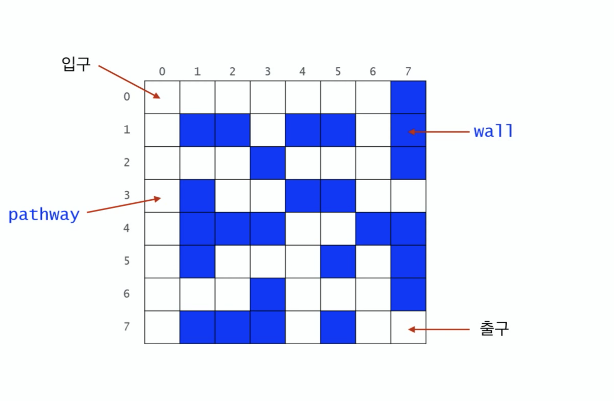
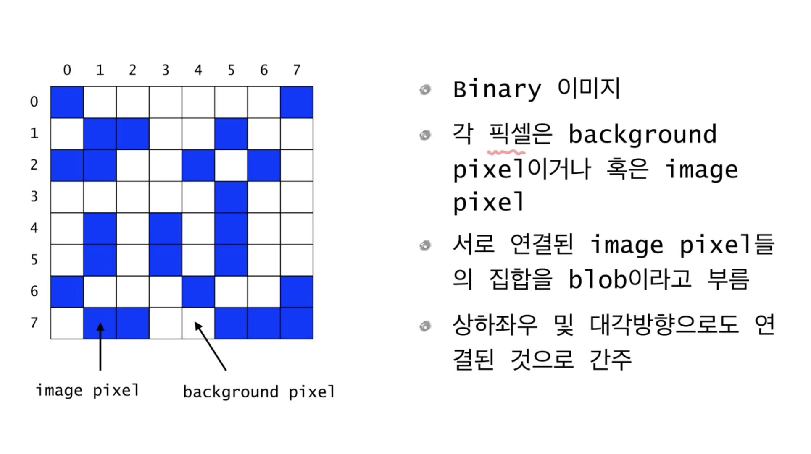
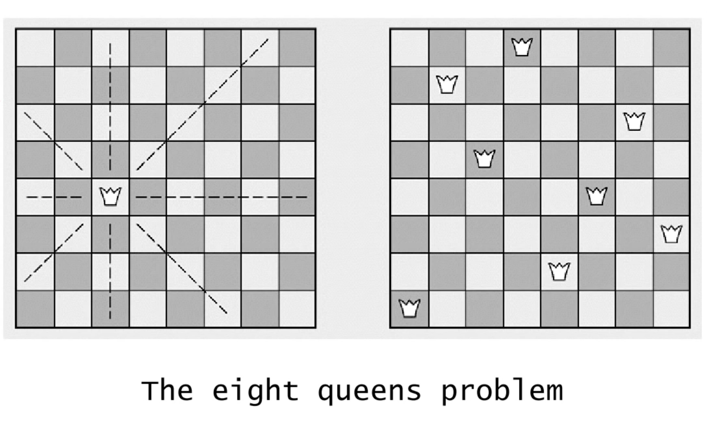
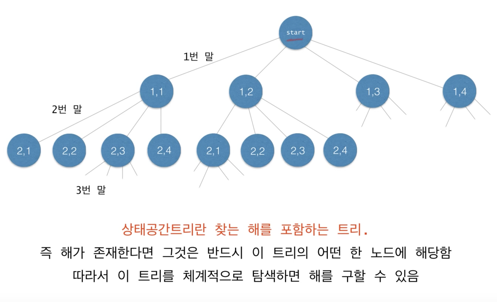
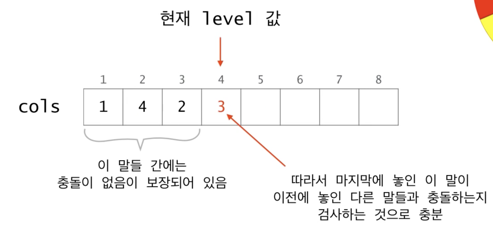
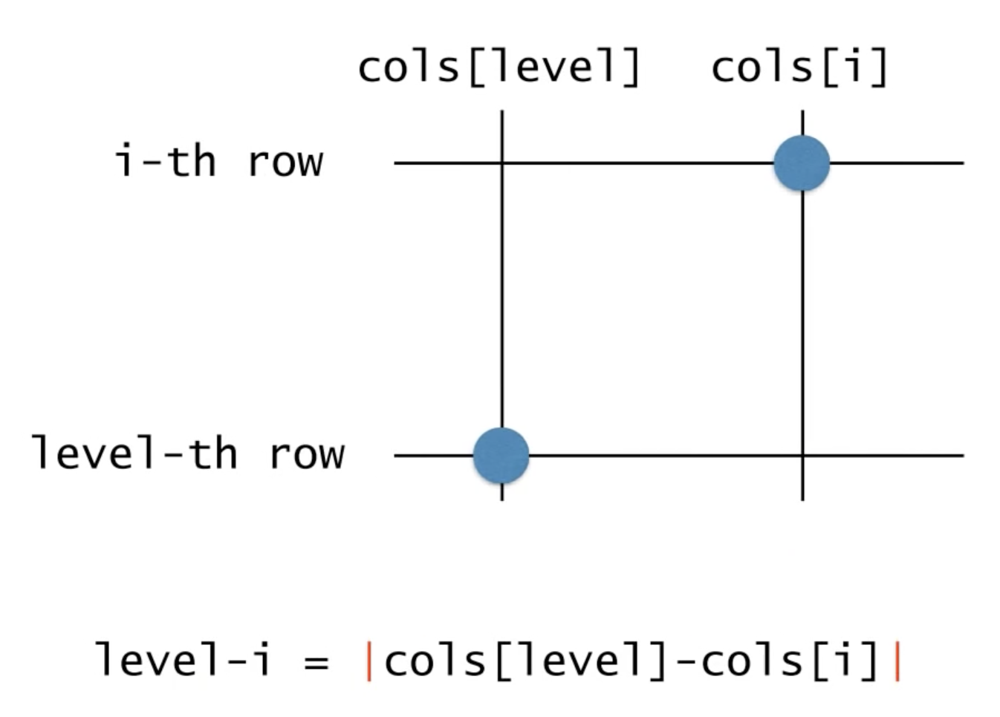
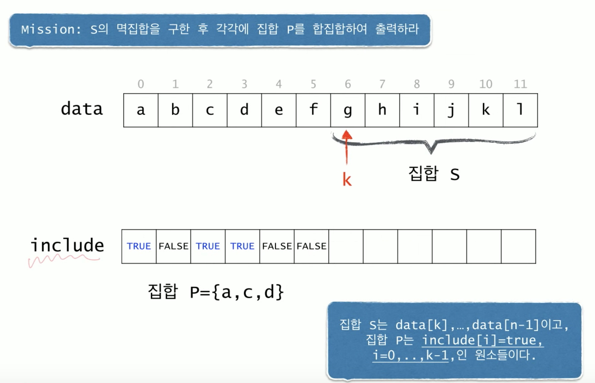
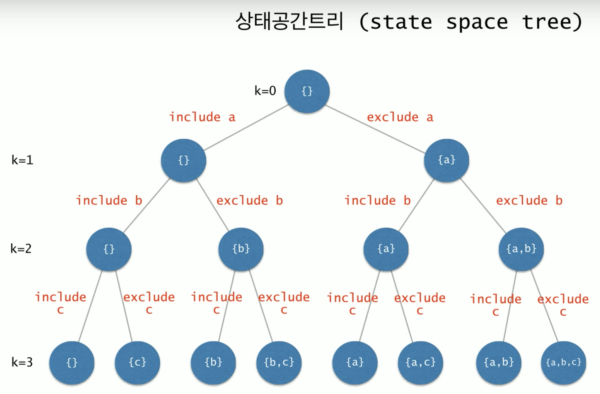

= 순환(Recursion)

=== 순환(Recursion)의 개념
* 자기 자신을 호출하는 함수

[source, java]
----
public class Recursion {
    public static void main(String[] args) {
        func();
    }

    public static void func() {
        System.out.println("Hello");
        // 무한루프
        func();
    }
}
----

===== 무한루프에 빠지지 않는 조건
* Base Case 
** 적어도 하나에 재귀에 빠지지 않은 경우가 존재해야 함
* Recursion Case
** Recursion을 반복하다보면 결국 Base Case로 수정해야 함

[source, java]
----
public class Recursion {
    public static void main(String[] args) {
        int n = 4;
        func(n);
    }

    public static void func(int k) {
        // Base Case
        if(k <= 0) {
            return;
        } 
        
        System.out.println("Hello");

        // Recursion Case
        func(k-1);    
    }
}
----

===== 1 - n까지 합

[source, java]
----
public class Recursion {
    public static void main(String[] args) {
        int result = func(4);
        System.out.print(result);
    }

    public static int func(int n) {
        if(n == 0) {
            return 0;
        } 
        
        return n + func(n-1);
    }
}
----

===== Factorial: n! 

[source, java]
----
// 0! = 1
// n! = n x (n-1)! (n > 0)
public static int factorial(int n) {
    if(n == 0) {
        return 1;
    }

    return n * factorial(n-1);
}
----

===== x의 n제곱 계산

[source, java]
----
// x^0 = 1
// x^n = x * x^n-1 (n > 0)
public static double power(double x, int n) {
    if(n == 0) {
        return 1;
    }

    return x * power(x, n-1);
}
----

===== 피보나치 수열

[source, java]
----
// f0 = 0
// f1 = 1
// fn = fn-1 + fn-2 (n > 1)
public static int fibonacci(int n) {
    if(n < 2) {
        return n;
    }

    return fibonacci(n-1) + fibonacci(n-2)
}
----

===== 최대공약수(Euclid Method)

[source, java]
----
// m >= n인 두 양수 m, n에 대해서 m이 n의 배우이면 gcd(m, n) = n 이고, 그렇지 않으면 gcd(m, n) = gcd(n, m%n)
public static double gcd1(int m, int n) {
    if(m < n) {
        int tmp = m;
        m = n;
        n = tmp;    // swap
    }

    if(m % n == 0) {
        return n; 
    }

    return gcd(n, m % n);
}

public static double gcd2(int m, int n) {
    if(n == 0) {
        return m; 
    } 

    return gcd2(n, m % n)
}
----

===== 문자열 길이 계산
* 첫번쩨 접근 -> for, while 이용
* 두번째 접근 -> 순환함수 이용

[source, java]
----
public static int length(String str) {
    if(str.equals("")) {
        return 0;
    }

    return 1+length(str.substring(1));
}
----

===== 문자열 프린트

[source, java]
----
public static void printChars(String str) {
    if(str.length() == 0) {
        return;
    }

    System.out.println(str.charAt(0));
    printChars(str.substring(1));
}
----

===== 문자열을 뒤집어 프린트

[source, java]
----
public static void printReversedChars(String str) {
    if(str.length() == 0) {
        return;
    }

    printReversedChars(str.substring(1));
    System.out.println(str.charAt(0));
}
----

===== 배열의 합 구하기
* data[0]에서 data[n-1]까지 합을 구하여 반환함

[source, java]
----
public static int sum(int num, int[] data) {
    if(num <= 0) {
        return 0;
    }

    return sum(num-1, data) + data[num-1];
}
----

===== Recursion, Iterator
* 모든 순환함수는 반복문(Iteration)으로 변경 가능
* 그 역도 성림함. _모든 반복문은 recursion으로 표현 가능_
* 순환함수는 복잡한 알고리즘을 단순하고 알기쉽게 표현하는 것이 가능함
* 함수 호출에 따른 오버헤드가 있음(매개변수 전달, 엑티베이션 프레임 생성 등)

=== 순환적 알고리즘 설계
* 적어도 하나의 base case, 즉 순환되지 않고 종료되는 case가 있어야 함
* 모든 case는 결국 base case로 수렴해야 함

===== 매개변수의 명시화
* 암시적(Implicit) 매개변수를 명시적(Explicit) 매개변수로 바꾸어라!

===== 순차탐색, 순차검색

[source, java]
----
// 데이터 하나씩 순차적으로 검색함
// data[0]에서 data[n-1] 사이에서 target을 검색함
// [0, n-1] 중에서 n-1은 명시적으로 나타나지만 
// 0인 시작구간이 명시적으로 나타나지 않음(암시적임)
// 코드 간결성을 위해서 명시적으로 나타나지 않는 것이 좋지만, Recursion으로 변경될 때 명시적인 것이 좋음
public class SequentialSearch {
    public static void main(String[] args) {
        int[] ints = new int[] {1, 2, 3, 4, 5};
        System.out.println(search(ints, ints.length, 3));
        System.out.println(search2(ints, 1, ints.length-1, 3));
        System.out.println(search3(ints, 1, ints.length-1, 3));
        System.out.println(search4(ints, 1, ints.length-1, 3));
    }

    // before
    public static int search(int[] data, int n, int target) {
        for(int i=0 ; i<n ; i++) {
            if(data[i] == target) {
                return i;
            }
        }

        return -1;
    }

    // 시작 구간을 명시적으로 나타냄 -> 자기 자신을 호출 할 때 필요한 매개변수는 명시적으로 나타내야 함
    // 생략할 수 있다면 생략해도 됨
    public static int search2(int[] data, int begin, int end, int target) {
        if(begin > end) {
            return -1;
        }

        if(target == data[begin]) {
            return begin;
        }

        return search2(data, begin+1, end, target);
    }

    public static int search3(int[] data, int begin, int end, int target) {
        if(begin > end) {
            return -1;
        }

        if(target == data[end]) {
            return end;
        }

        return search3(data, begin, end-1, target);
    }

    public static int search4(int [] data, int begin, int end, int target) {
        if(begin > end) {
            return -1;
        }

        int middle = (begin + end) / 2;
        if(data[middle] == target) {
            return middle;
        }

        int index = search4(data, begin, middle-1, target);

        if(index != -1) {
            return index;
        }

        return search4(data, middle+1, end, target);
    }
}
----

===== 최대값 찾기
* data[begin] 에서 data[end] 사이에서 최대값을 찾아 반환함. begin <= end을 가정함

[source, java]
----
public class MaxNumber {
    public static void main(String[] args) {
        int[] ints = new int[] {1, 2, 3, 4, 5};
        System.out.println(findMax(ints, 1, ints.length-1));
        System.out.println(findMax2(ints, 1, ints.length-2));
    }

    public static int findMax(int[] data, int begin, int end) {
        if (begin == end) {
            return data[begin];
        }

        return Math.max(data[begin], findMax(data, begin+1, end));
    }

    public static int findMax2(int[] data, int begin, int end) {
        if (begin == end) {
            return data[begin];
        }

        int middle = (begin + end) / 2;
        int max1 = findMax(data, begin, middle);
        int max2 = findMax(data, middle+1, end);

        return Math.max(max1, max2);
    }
}
----

===== 이진 탐색
* items[begin]에서 items[end] 사이에서 target을 검색함

[source, java]
----
public class BinarySearch {
    public static void main(String[] args) {
        String[] strings = new String[] {"강", "현", "정", "웅", "감", "자"};
        System.out.println(binarySearch(strings, "웅", 1, strings.length-1));
    }

    public static int binarySearch(String[] items, String target, int begin, int end) {
        if (begin > end) {
            return -1;
        }

        int middle = (begin + end) / 2;
        int compResult = target.compareTo(items[middle]);

        if (compResult == 0) {
            return middle;
        }

        if (compResult < 0) {
            return binarySearch(items, target, begin, middle-1);
        }

        return binarySearch(items, target, middle+1 , end);
    }
}
----

=== 미로찾기(Maze)

===== Recursive Thinking
* _현재 위치에서 출구까지 가는 경로_ 가 있으려면
** 현재 위치가 출구이거나
** 이웃한 셀들 중 하나에서 _현재 위치를 지나지 않고 출구까지 가는 경로_ 가 있거나

===== Decision Problem
* 답이 Yes or No인 문제
* 무한루프에 빠지지 않는가?
** Base case가 있는가?
** Base case로 수렴하는가?

===== 수도코드

----
// 1
boolean findPath(x, y) 
    if (x, y) is the exit 
        return true;
    else 
        for each neighbouring cell (x', y') of (x,y) do
            if (x', y') is on the pathway
                if findPath(x', y')
                    return true;
        
        return false;

// 2. 기본 위치와 가지 않는 위치 구분
boolean findPath(x, y) 
    if (x, y) is the exit 
        return true;
    else 
        // 내가 가본 위치를 마크함
        mark (x, y) as a visited cell;  

        for each neighbouring cell (x', y') of (x,y) do
            if (x', y') is on the pathway and not visited
                if findPath(x', y')
                    return true;
        
        return false;

// 3. 방문한 곳과 벽인 곳이면 바로 false 반환
// 2번 코드에 비해 함수 호출은 더 많아지지만 코드가 간결해짐
boolean findPath(x, y) 
    if (x, y) is either on the wall or a visited cell
        return false;
    else if (x, y) is the exit
        return true;
    else 
        mark (x, y) as a visited cell;  

        for each neighbouring cell (x', y') of (x,y) do
            if findPath(x', y')
                return true;
        
        return false;
----

===== Class Maze

[source, java]
----
public class Maze {
    private static int N = 8;
    private static int [][] maze = {
        {0, 0, 0, 0, 0, 0, 0, 1},
        {0, 1, 1, 0, 1, 1, 0, 1},
        {0, 0, 0, 1, 0, 0, 0, 1},
        {0, 1, 0, 0, 1, 1, 0, 0},
        {0, 1, 1, 1, 0, 0, 1, 1},
        {0, 1, 0, 0, 0, 1, 0, 1},
        {0, 0, 0, 1, 0, 0, 0, 1},
        {0, 1, 1, 1, 0, 1, 0, 0}
    };

    private static final int PATHWAY_COLOR = 0;    // white, 길
    private static final int WALL_COLOR = 1;       // blue, 벽
    private static final int BLOCKED_COLOR = 2;    // red, 이미 방문하였으며 출구까지의 경로상에 있지 않음이 밝혀진 cell
    private static final int PATH_COLOR = 3;       // green, 방문하였지만 아직 출구로 가는 경로가 될 가능성이 있는 cell

    public static void main(String[] args) {
        printMaze();
        findMzePath(0, 0);
        printMaze();
    }

    public static boolean findMzePath(int x, int y) {
        if (x<0 || y<0 || x>=N || y>=N) {
            return false;
        }

        if (maze[x][y] != PATHWAY_COLOUR) {
            return false;
        }

        if (x == N-1 && y == N-1) {
            maze[x][y] = PATHWAY_COLOUR;
            return true;
        }

        maze[x][y] = PATH_COLOUR;

        if(findMzePath(x-1, y) || findMzePath(x, y+1) || findMzePath(x+1, y) || findMzePath(x, y-1)) {
            return true;
        }

        maze[x][y] = BLOCKED_COLOUR;
        return false;
    }

    public static void printMaze() {
        for(int i=0 ; i<8 ; i++) {
            for(int j=0 ; j<8 ; j++) {
                System.out.print(maze[i][j] + " ");
            }

            System.out.println("");
        }

        System.out.println("");
    }
}
----

===== 과제
* 두번째로 미로찾기 문제 풀기

=== Counting Cells in a Blob

* size = 5, 1, 5, 13
* 총 4개의 Blob
* 입력
** N*N 크기의 2차원 그리드
** 하나의 좌표(x, y)
* 출력
** 픽셀 (x, y)가 포함된 blob의 크기
** (x, y)가 어떤 blob에도 속하지 않는 경우 0
* 간단하게 풀리지 않음. 동일한 Blob 판단하는 과정이 어려움

===== Recursive Thinking
* 현재 픽셀이 속한 blob의 크기를 카운트하려면
** 현재 픽셀이 image color가 아니라면
*** 0을 반한함
** 현재 픽셀이 image color라면
*** 먼저 현재 픽셀을 카운트함(count = 1)
*** 현재 픽셀이 중복 카운트 되는 것을 방지하기 위해 다른 색으로 칠함
*** 현재 픽셀이 이웃한 모든 픽셀들에 대해서 
**** 그 픽셀이 속한 blob의 크기를 카운트하여 카운터에 더해줌
*** 카운터를 반환함

===== 수도코드

----
Algorithm for countCells(x, y) 
if the pixel (x, y) is outside the grid
    the result is 0;
else if pixel (x, y) is not an image pixel or already counted
    the result is 0;
else 
    set the color of the pixel (x, y) to a red color;
    the result is 1 plus the number of cells in each piece of  
        the blob that includes a nearest neighbour;
----

===== Class Blob

[source, java]
----
public class Blob {
    private static int N = 8;
    private static int [][] grid = {
        {1, 0, 0, 0, 0, 0, 0, 1},
        {0, 1, 1, 0, 0, 1, 0, 0},
        {1, 1, 0, 1, 0, 1, 0, 0},
        {0, 0, 0, 0, 0, 1, 0, 0},
        {0, 1, 0, 1, 0, 1, 0, 0},
        {0, 1, 0, 1, 0, 1, 0, 0},
        {1, 0, 0, 0, 1, 0, 0, 1},
        {0, 1, 1, 0, 0, 1, 1, 1}
    };

    public static void main(String[] args) {
        printGrid();
        countCells(0, 0);
        printGrid();
    }

    private static int BACKGROUND_COLOR = 0;
    private static int IMAGE_COLOR = 1;
    private static int ALREADY_COUNTED = 2;

    public static int countCells(int x, int y) {
        if (x<0 || x>=N || y<0 || y>=N) {
            return 0;
        }

        if(grid[x][y] != IMAGE_COLOR) {
            return 0;
        }

        grid[x][y] = ALREADY_COUNTED;
        return 1 + countCells(x-1, y+1) + countCells(x, y+1)
                + countCells(x+1, y+1) + countCells(x-1, y)
                + countCells(x+1, y) + countCells(x-1, y-1)
                + countCells(x, y-1) + countCells(x+1, y-1);
    }

    public static void printGrid() {
        for(int i=0 ; i<8 ; i++) {
            for(int j=0 ; j<8 ; j++) {
                System.out.print(grid[i][j] + " ");
            }

            System.out.println("");
        }

        System.out.println("");
    }
}
---- 

=== N-Queens
* N*N 판에서 N개의 말

===== Bracktracking

* 상태 공간 트리
** 내가 찾고 있는 정답을 포함하고 있는 트리
** 상태 공간 트리의 모든 노드를 탐색해야 하는 것은 아님

* 되추적 기법(Backtracking) => 내가 해온 과정을 돌아감. 결정들을 하다가 막다른 결과에 도달하면 가장 최근에 내린 결정을 번복하고 다시 함
** 깊이 우선 탐색
** 상태 공간 트리를 깊이 우선 방식으로 탐색하여 해를 찾는 알고리즘을 말함
** Recursion, Stack 으로 구현할 수 있음

===== 수도코드

----
// 1
// * arguments => 내가 현재 트리의 어떤 노드에 있는지 지정해야 함
return-type queens(arguments) {
    if non-promising    // 꽝
        report failure and return;
    else if success
        report answer and return;
    else 
        visit children recursively;
}

// 2
// * 매개변수 level은 현재 노드의 행을 표현하고, 1번에서 level 말이 어디에 놓였는지는 전역변수 배열 cols로 표현하자
// * cols[i] = j는 i번 말이 (i행, j열)에 놓였음을 의미함
int [] cols = new int[N+1];
return-type queens(int level) {
    if non-promising   
        report failure and return;
    else if success
        report answer and return;
    else 
        visit children recursively;
}

// 3
// return type은 boolean으로 성공 또는 실패를 반환함
int [] cols = new int[N+1];
boolean queens(int level) {
    if non-promising    
        report failure and return;
    else if success
        report answer and return;
    else 
        visit children recursively;
}

// 4
// * 노드가 어떤 경우에 non-promising일까? 일단 이 문제는 나중에 생각하자
int [] cols = new int[N+1];
boolean queens(int level) {
    if (!promising(level))
        return false;
    else if success
        return answer and return;
    else 
        visit children recursively;
}

// 5
// * promising 테스트를 통과했다는 가정하에 level == N이면 모든 말이 놓았다는 의미이고 따라서 성공임
int [] cols = new int[N+1];
boolean queens(int level) {
    if (!promising(level))
        return false;
    else if (level == N)
        return true;
    else 
        visit children recursively;
}

// 6
// * level + 1번째 말을 각각의 열에 놓은 후 recursion을 호출함
int [] cols = new int[N+1];
boolean queens(int level) {
    if (!promising(level))
        return false;
    else if (level == N)
        return true;

    for (int i=1 ; i<=N ; i++) {
        cols[level+1] = i;

        if(queens(level+1)) {
            return true;
        }
    } 

    return false;
}
----

* Promising Test

----
// 1
boolean promising(int level) {
    for(int i=1; i<level; i++) {
        // 같은 열에 놓였는지 검사
        if(cols[i] == cols[level]) {
            return false;
        // 같은 대각선에 놓았는지 검사
        } else if on the same diagonal {
            return false;
        }
    }

    feturn true;
}

// 2
boolean promising(int level) {
    for(int i=1; i<level ; i++) {
        // 같은 열에 놓였는지 검사
        if(cols[i] == cols[level]) {
            return false;
        // 같은 대각선에 놓았는지 검사
        } else if (level-i == Math.abs(cols[level]-cols[i])) {
            return false;
        }
    }

    return true;
}
----

* 1번째 같은 대각선에 놓였는지 검사
** level-i = abs(cols[level]-cols[i])

===== Class Queens

[source, java]
----
public class Queens {
    private static int N = 8;
    private static int[] cols = new int[N+1];

    public static void main(String[] args) {
        queens(0);
    }

    public static boolean queens(int level) {
        if(!promising(level)) {
            return false;
        }

        if(level == N) {
            print();
            return true;
        }

        for(int i=1 ; i<=N ; i++) {
            cols[level+1] = i;

            if(queens(level+1)) {
                return true;
            }
        }

        return false;
    }

    public static boolean promising(int level) {
        for(int i=1 ; i<level ; i++) {
            if(cols[i] == cols[level]) {
                return false;
            }

            if(level-i == Math.abs(cols[level]-cols[i])) {
                return false;
            }
        }

        return true;
    }

    public static void print() {
        for(int i=1 ; i<=N ; i++){
            System.out.println(i + "행, " + cols[i] + "열");
        }
    }
}
----

=== 멱집합(Powerset)

===== 멱집합(Powerset)
* 임의의 집합 data의 모든 부분집합을 출력하라
* {a, b, c, d, e, f} 의 모든 부분집합을 나열하려면
** a를 제외한 {b, c, d, e, f}의 모든 부분집합들을 나열하고 => 2^5
** {b, c, d, e, f}의 모든 부분집합에 _{a}를 추가한 집합들을_ 나열함 => 2^5
** 2^6 = 32개
* {b, c, d, e, f}의 모든 부분집합에 {a}를 추가한 집합들을 나열하려면
** {c, d, e, f}의 모든 부분집합들에 {a}를 추가한 집합들을 나열하고
** {c, d, e, f}의 모든 부분집합에 {a, b}를 추가한 집합들을 
* {c, d, e, f}의 모든 부분집합에 {a}를 추가한 집합들을 나열하려면
** {d, e, f}의 모든 부분집합들에 {a}를 추가한 집합들을 나열하고
** {d, e, f}의 모든 부분집합에 {a, c}를 추가한 집합들을 나열함

===== 수도코드

----
// 1
// * S의 멱집합을 출력하라
powerSet(S) 
if s is an empty set
    print nothing;
else 
    let t be the first element of S;
    // powerSet 함수는 여러 개의 집합들을 return 해야 함. 어떻게 ?
    // 2^n-1 메모리를 어디에다가 저장할 것인가??
    // 메모리를 사용하기 때문에 출력하는 것으로 바꿈
    find all subsets of s--{t} by calling powerSet(S-{t});

    // return all of them
    print the subset;
    print the subsets with adding t;

// 2
// * S의 멱집합을 구한 후 각극 집합 P를 합집합으로 출력하라
powerSet(P, S) 
if s is an empty set
    print P;
else 
    let t be the first element of S;
    // recursion 함수가 두 개의 집합을 매개변수로 받도록 설계해야 한다는 의미
    // 두번째 집합의 모든 부분집합들에 첫번째 집합을 합집합하여 출력함 
    // t를 포함하지 않는 부분집합
    powerSet(P, S-{t});
    // t를 포함한 부분집합
    powerSet(PU{t}, S-{t});
----

===== 두 집합의 표현
* 집합 P가 포함되면 true, 포함되지 않으면 false

===== Class Powerset

[source, java]
----
// data[k], ..., data[n-1]의 멱집합을 구한 후, 각각 include[i] = true, i = 0, ..., k-1 인 원소를 추가하여 출력하ㅏ
// 처음 이 함수는 호출할 때 powerSet(0)으로 호출함. 즉 P는 공집합이고 S는 전체집합임
public class Powerset {
    private static char data[] = {'a', 'b', 'c', 'd', 'e', 'f'};
    private static int n = data.length;
    private static boolean[] include = new boolean[n];

    public static void main(String[] args) {
        powerSet(1);
    }

    // include, k => 트리 상에서 현재 나의 위치를 표현함
    public static void powerSet(int k) {
        // 만약 내 위치가 리프노드라면
        if (k == n) {
            for(int i=0 ; i<n ; i++) {
                if(include[i]) {
                    System.out.print(data[i] + " ");
                }
            }

            System.out.println();
            return;
        }

        include[k] = false; // data[k]를 포함하지 않는 집합
        powerSet(k+1);      // k+1 => 먼저 왼쪽으로 내려갔다가 
        
        include[k] = true;  // data[k]를 포함한 집합
        powerSet(k+1);      // k+1 => 그 다음 오른쪽으로 내려감
    }
}
----

===== {a, b, c} 멱집합 시각화
* 순서가 바뀜 
** exclude a => 왼쪽, include a => 오른쪽
** 노드 개수는 8개
** 모든 집합의 개수를 찾는 것 => 해 

===== 상태공간트리(State Space Tree)
* 해를 찾기 위해 탐색할 필요가 있는 모든 후보들을 포함하는 트리
* 트리의 모든 노드들을 방문하면 해를 찾을 수 있음
** 어떤 문제를 풀기 위한 과정을 추상화 하려면 그 문제에 대한 상태 공간 트리를 구성한 다음에
** 해를 찾는다는 것은 모든 문제의 해를 찾을 수 있음
* 루트에서 출발하여 체계적으로 모든 노드를 방문하는 절차를 기술함

=== 참고
* https://www.inflearn.com/course/%EC%95%8C%EA%B3%A0%EB%A6%AC%EC%A6%98-%EA%B0%95%EC%A2%8C/[인프런 - 영리한 프로그래밍을 위한 알고리즘 강좌]