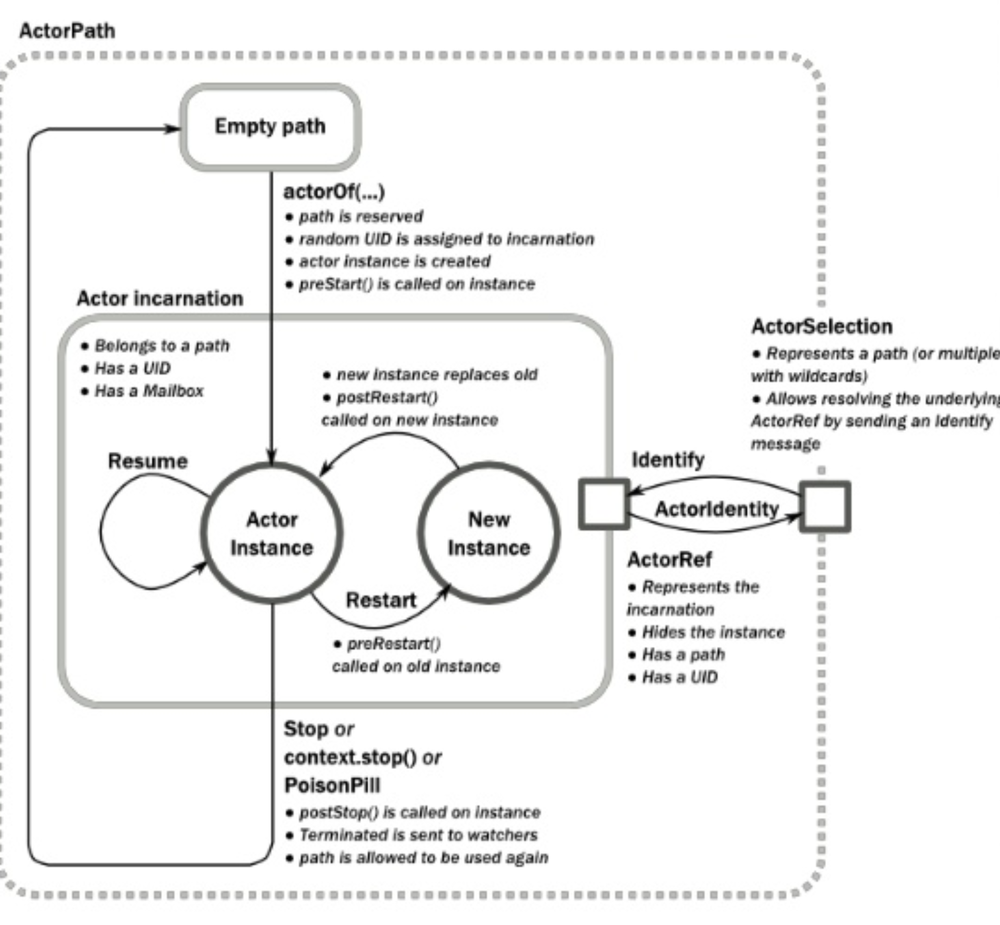

= Akka 코딩 공작소

=== Akka
* https://www.slideshare.net/jbugkorea/ss-39607946[Actor Model]
* Scala로 구성됨
* Java, Scala API 제공 

=== Actor
* 규모 확장성이 좋은 시스템을 개발하는 데 사용함
* Akka의 Actor Model을 사용하고 있으나 Erlang이랑 다름
* Actor는 Behavior, State, Mailbox로 구성됨
* Actor 사이에 공유된 자원은 없음
* Message 통신만 가능함
* Actor가 수행되는 모든 것은 비동기 처리
* 송신
** 메세지 통신
** 비동기
** 동시성 모델은 불변성이 절대적으로 필요함
* 생성
** Actor는 다른 Actor를 생성할 수 있음
** Actor가 Actor를 생성할 수 있기 때문에 관리자 역할을 하는 것이 Supervisor, 활동하는 역할은 Worker
** 트리 구조
* 상태 변화
* 감독 
** Supervisor는 Worker 상태를 감시함
** Worker는 다른 Worker를 신경을 쓰지 않음

===== Actor Model in Akka
* ActorRef
** MailBox를 가지고 있음
** 모든 메세지는 ActorRef를 통함
* Dispatcher
** MailBox에 있는 메세지를 처리하라고 알리는 역할을 함
** Push 시점을 정할 수 없지만 하나의 Actor나 그룹단위 Actor를 Dispatcher가 관리하느냐 설정이 가능함

===== 기존 방식과 Actor Scale Up & Scale Out 차이점
|===
| 목표 | 일반 | Actor 

| 애플리케이션이 중지되더라도 데이터 망가지지 않게 함 
| 데이터베이스 의존 
| 메모리 상태 유지. 변경되면 로그 파일 저장. 재시작되더라도 로그파일 읽어옴

| 상호작용 기능 제공
| 이벤트 드리븐으로 구현
| 관심 있는 부분이나 중요한 이벤트 때만 Actor에게 통보

| 서비스 분리
| Message Queue 추가
| 이미 Message 주고받는 형태로 구현됨

| Exception 발생 시, 서비스 지속
| 실패 시나리오를 발생하고 예외 상황에 대해 코드를 작성해야 함
| 문제가 생긴 Actor만 처리. 다른 Actor에 영향을 끼치지 않음
|===

=== Fault Tolerance(장애허용)
* Java, C#은 try-catch-finally문으로 에러 처리함
* Akka 에러 처리하는 방법은 중단되게 내버려둠

===== Worker Actor(FileWatcher => LogProcessor => DbWriter)에서 오류 나서 중단되면 Supervisor Actor(LogProcessingSupervisor)가 Worker Actor에 대해 선택함
* 재시작(Restart)
* 계속 진행(Resume)
* 종료(Stop)
* 위로 전달(Ecalate)

===== 장애허용 장점
* 고장 격리, System에 영향을 끼치지 않고 독립적으로 구성할 수 있음

===== 장애허용을 이해하기 위해서 Actor Life Cycle를 이해해야 함
|===
| 이벤트 | 설명

| preStart()
| Actor가 시작되기 전에 호출

| postStop()
| Actor가 종료되기 직전 바로 호출

| preRestart() 
| 재시작되면 에러로 인해 중단된 Actor 인스턴스가 호출

| postRestart()
| 재시작되면 preRestart() 호출 이후, postRestart() 호출
|===

=== Akka Life Cycle

===== AkkaHttp
* 웹에서 비동기 처리하기 편함

=== Akka Future
* _미래 어느 시점에서 사용 가능한 함수를 담아두는 용기_
* 결과에 대한 비동기적으로 처리함
* 자원 활용 최대화, 불필요한 지연 시간을 최소화
* Future를 이용하면 결과를 다른 코드로 정의할 수 있음
* Future는 함수의 결과를 표현하는 것
* Future 안에서 Actor가 변경 가능한 상태를 참조하는 것은 피해야 함
* Actor는 반드시 Ask 함수의 반환 값으로 Future를 사용해야 되며, Future 결과를 pipe 패턴을 이용하여 Send 할 수 있음

===== Java Future와 비교
* Java Future는 polling이 필요하며 블로킹은 get메서드를 사용해야 함
* Scala Future는 블로킹이나 폴링이 필요하지 않으며 함수 결과를 조합할 수 있음
* Java8 => CompletableFuture<T>가 오히려 비슷