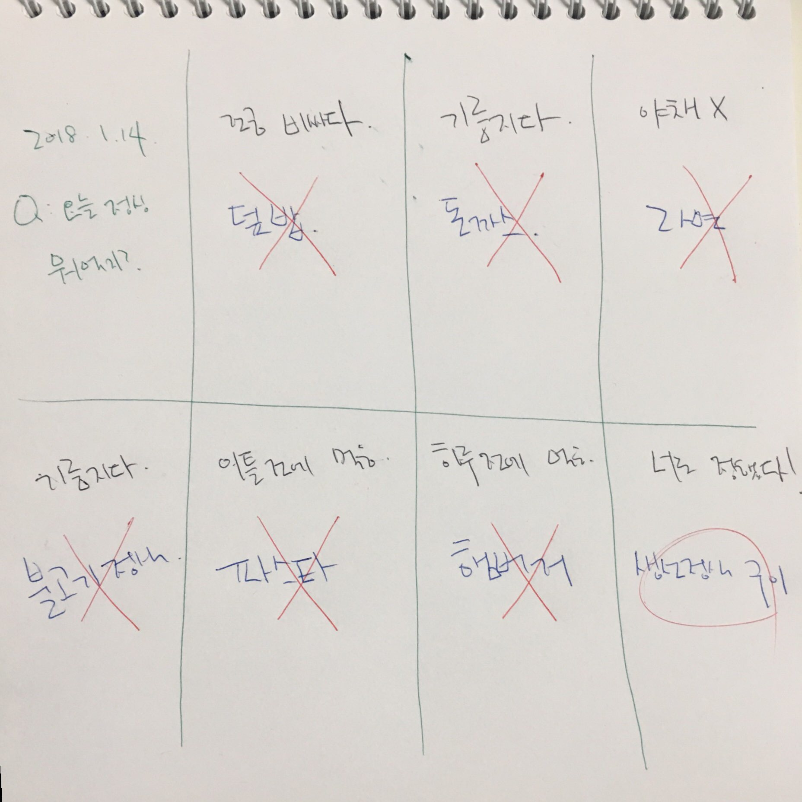

= 도요타에서 배운 종이 한 장으로 요약하는 기술

=== 종이 한 장으로 요약하는 기술이 왜 필요할까?
* 종이 한 장으로 요약할 때 좋은 점을 알려주고 있음
* 그중에서 공감이 갔던 챕터만 발췌하였음

===== 종이에 적어보면 '안다'와 '모른다'가 보인다!!
* _내가 만든 한 장은 내 머릿속 그 자체였다_
* 한 장으로 요약하기 위해 내용을 줄이는 과정에서 정보의 중요도를 올바르게 이해하고 있는지 알 수 있음

=== 종이 한 장으로 요약하는 기술

===== 한 장을 만들기 위한 세 가지 단계
* 서류 한 장으로 요약하는 데 중요한 것은 자료 작성법보다 이전 단계인 생각 정리법임

----
1. 생각하는 토대가 될 정보를 서류에 정리함
2. 자기 나름대로 생각을 서류에 요약함
3. 서류의 내용을 누군가에게 전달함
----

===== '어떻게?'를 '동작'으로 바꾸자!
* '좀 더 깊이 생각한다.' 라고 많이 이야기하지만 구체적인 예시가 없음
* '어떻게 하는거지?' 라고 고민하게 됨
* 따라서, _요구 표현에 표현된 **동사**를 **동작**으로 변환시켜 누구든지 재현할 수 있도록 함_
* 동사로 속이지 않고 동작으로 바꾸면 비로소 실천이 가능해짐

===== 엑셀 1
* 한 장으로 요약하는 데 필요한 재료
** 주제 => 요약하기 전 무엇을 요약할 것인지 주제를 정하는 것이 중요함
** 3색(빨강, 파랑, 녹색) 펜
** 한 장의 종이
* 엑셀 1의 사용법
** 녹색펜으로 틀을 만들고 
** 그 안에 파란펜으로 머릿속 정보를 정리함
** 빨간펜으로 적은 정보에 대한 사고를 발전시킴
** 종이를 보면서 하므로 생각이 달아나지 않아 집중할 수 있음
** 평소에 생각을 요약하는 작업이 서툰 사람은 머릿속에서만 하려고 하므로 사고가 진전되지 않음
* 종이에 적는 시간을 제한해야 하는 이유
** 아래 예시 이미지처럼 8개 있는 경우라면 주제가 적혀 있는 한 개를 제외하고 나머지 7개 틀을 메우는 시간은 1분으로 제한해야 함
** 시간을 정하지 않으면 쓸데없어 계속 생각만 하고 요약하지 않기 때문임
** 필요하지 않다고 제한할 것이 아니라 일단 적음
** 눈 앞의 작업에 집중할 수 있고
** 한 번에 완벽하게 하지 않으려고 함 => 해보고 이해되지 않으면 몇 번이고 다시 하면 됨

----
1. 틀을 만듦
* 4개, 8개, 16개, 32개 등 칸을 나눔
* 녹센펜으로 선을 그음
* 칸의 개수는 상관없지만 한 칸의 크기가 크지 않도록 하는 것이 중요함 
2. 키워드로 메움
* 녹색 펜으로 주제를 기재하고 
* '구조는 녹색으로 적는다' 라는 규칙을 정해둠
* 파란 펜으로 생각나는 대로 나머지 칸에 키워드를 채움
3. 떠오르는 생각을 적음
* 생각 과정을 요약하는 과정이기 때문에 빨간 펜을 사용함
* 빨간펜으로 스스로 질문을 던짐 
* '뭘 먹지?' => '어? 왠지 기름진 게 많아.', '모두 야채가 너무 적군...'
* 빨간펜으로 아닌 것은 x를 표시하고 결과를 정하게 됨 
----

===== 엑셀 1의 사용법 : 일의 우선순위를 정함
* 우선순위를 정할 때 정하지 못하는 이유는 우선순위를 정한다는 것이 동사이기 때문임
* 구체적인 동작으로 바꾸어야 함
** "공부해라" => "이 책의 이 부분을 읽어라" 또는 "이 교재의 3단원 문제를 풀어라"
* 엑셀 1을 이용하여 우선 순위를 정하는 방법
** 녹센펜으로 틀을 만듦
** 파란펜으로 오늘 할 일을 순서 상관없이 기입함
** 빨간펜으로 "이 중에서 특히 중요한 알은 어느 것인가?" 생각하고 최대 3개까지 동그라미 표시를 함 
** 그 다음, "오늘 중으로 대응하지 않으면 곤란한 것은 어느 것인가?" 생긱히고 최대 3개까지 세모 표시함
** 마지막으로 "내버려두면 곤란한 것이나 알은 어느 것인가?" 생각하고 최대 3개까지 네모표시를 함
** 전체를 보고 동그라미, 세모, 네모 다 표시되거나 동그라미, 세모가 표시된 것을 최상위 순위로 정함
** 여러 개가 둘러싸인 것이 없다면 세모표시 한 것을 우선순위로 정함