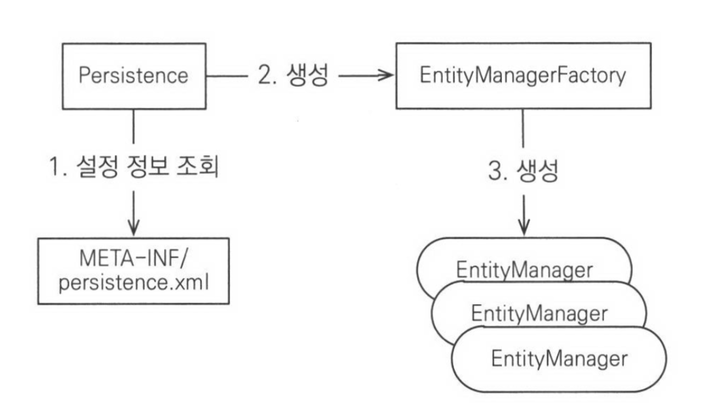
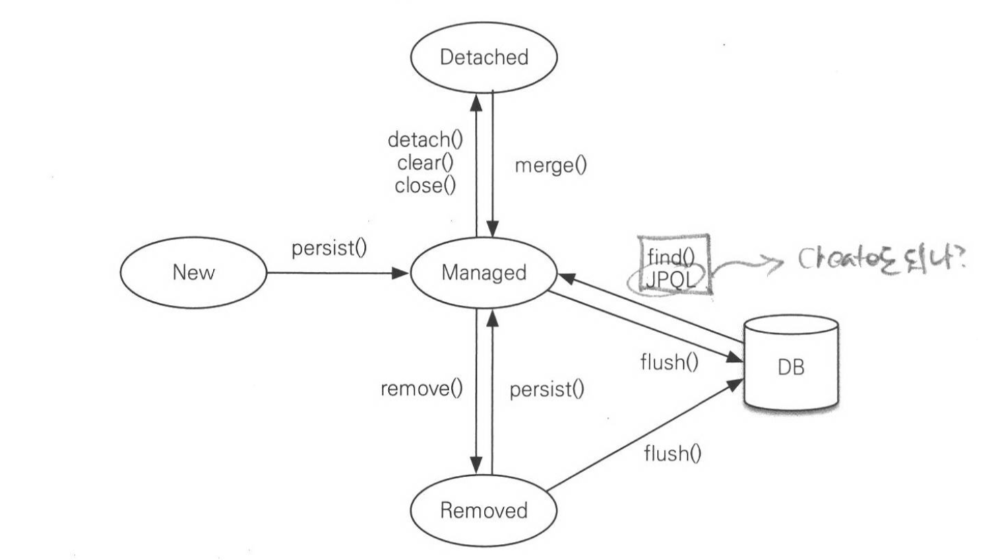

= 자바 ORM 표준 JPA 프로그래밍

=== 1장

===== 관계형 데이터베이스, 객체지향 언어의 패러다임 불일치 -> 많은 시간과 비용을 쏟고 있음
* 관계형 데이터베이스 : 데이터 중심
* 객체지향 언어 : 객체 중심    

===== _JPA(Java Persistence API)_
* Java ORM 기술에 대한 API 표준 명세
* Entity 분석, 쿼리 생성, JDBC 연결, 패러다임 불일치 해결 -> ORM 처리
* 성능 -> DB 직접적으로 여러번 조회 할 부분을 최소한으로 조회한 뒤, 해당 객체를 재활용함

=== 2장

===== 객체 매핑
* `@Entity`
** 해당 클래스가 테이블과 매핑한다고 JPA에게 알려줌
* `@Table`
** 엔티티 클래스가 매핑할 테이블 정보를 알려줌
* `@Id`
** 엔티티 클래스 필드를 테이블 Primary Key에 매핑함
* `@Column`
** 필드를 테이블 컬럼에 매핑함

===== 데이터베이스 방언
* 예를 들어 페이징 처리 시, MySQL -> LIMIT, ORACLE -> ROWNUM 등 각 DB에서 지원하는 함수나 SQL문법이 다른데, 이를 데이터 베이스 방언이라고 함
* org.hibernate.dialect-

===== 애플리케이션 개발

* 엔티티 매니저 팩토리 생성
** persistence.xml 설정 정보 -> JPA 동작 기반 객체 생성 -> DB 커넥션 풀 생성 -> 엔티티 팩토리 매니저 생성 비용은 크기 때문에 애플리케이션에서 딱 한번 생성하고 공유해서 씀 

[source, java]
----
EntityManagerFactory emf = Persistence.createEntityManagerFactory("jpabook");
----

* 엔티티 매니저 생성
** 엔티티 매니저로 엔티티를 데이터베이스에 조회,수정,등록,삭제를 할 수 있음

[source, java]
----
EntityManager em = emf.createEntityManager();
----

===== JPQL, SQL
* JPQL 
** 엔티티 대상으로 쿼리함
* SQL
** 데이터베이스 테이블 대상으로 쿼리함 

=== 3장

===== 엔티티 매니저 팩토리
* 엔티티 매니저를 만듬
* 여러 스레드 간에 공유해도 안전함

===== 엔티티 매니저
* 엔티티 조회,등록,수정,삭제 등을 관리함
* 여러 스레드 동시적으로 접근하면 동시성 문제 발생함

===== 영속성 컨텍스트(Persistence Context)
* 엔티티 매니저는 회원을 조회, 저장 등 동작하면 영속성 컨텍스트에 관리하고 저장함
* 엔티티 매니저가 생성하면 영속성 컨텍스트 하나 만듬
* 엔티티 매니저를 통해 영속성 컨텍스를 접근하고 관리할 수 있음
* 엔티티 생명주기
** 비영속(new, transient) -> 데이터베이스와 연관없음. 순수한 객체 상태
** 영속(managed) -> 영속성 컨텍스트에 의해 관리되고 있는 상태
** 준영속(detached) -> 영속 상태의 엔티티를 영속성 컨텍스트가 관리하지 않는 상태
** 삭제(removed) -> 데이터베이스와 영속성 컨텍스트에서 제거함

===== 영속성 컨텍스트 특징
* 영속상태는 식별자 값이 반드시 존재해야 함
* 1차 캐시
** 영속성 컨텍스트 내부에 가지고 있음
** 1차 캐시 키는 식별자 값임
** 만약 찾는 엔티티가 1차 캐시에서 있다면 데이터 베이스를 조회하지 않고, 1차 캐시에 있는 엔티티를 조회함. 데이터가 없다면 DB를 조회하고 1차 캐시에 엔티티를 저장함. 그리고 영속 상태 엔티티를 반환함
* Identity 보장(`==` 이용)
* 트랙잭션을 지원하는 쓰기 지연
** 엔티티 매니저는 실제 커밋되기 전까지, 쓰기 지연 SQL 저장소에 실제 쿼리를 저장함
** flush
*** 트랙잭션 커밋하기 전, 영속성 컨텍스트의 변경내용을 데이터베이스와 동기화 후 커밋처리함
* 변경 감지
** 엔티티의 변경사항을 데이터베이스에 자동으로 반영하는 기능
** 영속성 컨텍스트에 보관할 때, 최초 상태를 스냅샷이라고 함
** 변경 감지는 영속 상태 엔티티만 관리함
* 지연 로딩
** 실제 객체 대신 프록시 객체를 로딩해두고 해당 객체를 실제 사용할 때, 영속성 컨텍스트를 통해 데이터를 불러옴

===== 준영속
* 엔티티가 영속성 컨텍스트에서 분리된 상태
* 준영속 상태 엔티티는 영속성 컨텍스트의 관리를 받을 수 없음
* 준영속 상태 엔티티로 만드는 3가지 방법
** `em.detach(entity)` 
*** 1차캐시부터 쓰기 지연 SQL 저장소까지 특정 엔티티를 관리하지 말라고 명령함
** `em.clear()`
*** 영속성 컨텍스트에 들어있는 모든 엔티티를 준영속 상태로 만듬
** `em.close()`
*** 영속성 컨텍스트를 종료 시켜 해당 영속성 컨텍스트가 관리하던 엔티티를 준영속 상태로 만듬

===== 준영속 특징
* 거의 비영속 상태 가까움
* 그러나, 식별자 값을 가짐
* 지연로딩을 사용할 수 없음

===== 준영속이나 비영속을 영속 상태로 바꾸는 방법 
* `em.merge(entity)` 
** 준영속 상태 엔티티를 받아 새로운 영속상태 엔티티를 반환함. 즉, 파라미터로 넘어온 준영속 상태 엔티티는 그대로 남아있음

=== 4장

===== 엔티티 매핑
* 엔티티와 테이블을 정확하게 매핑하는 것
* 4가지 어노테이션 지원
** 객체와 테이블 매핑 -> @Entity, @Table
** 기본 키 매핑 -> @Id
** 필드와 컬럼 매핑 -> @Column
** 연관 관계 매핑 -> @ManyToOne, @JoinColumn

===== @Entity
* JPA를 사용해서 테이블과 매핑할 클래스는 @Entity 어노테이션을 필수로 붙임
* @Entity가 붙은 클래스는 JPA에서 관리하는 것으로 엔티티라 부름

.@Entity 속성
|===
| 속성 | 기능 | 기본값

| name
| JPA에서 사용할 엔티티 이름을 정의. 보통 클래스 이름을 사용
| 설정하지 않으면 클래스 이름을 사용
|===

* 주의사항
** 기본 생성자는 필수
** final 클래스, enum, interface, inner 클래스는 사용할 수 없음
** 저장할 필드에 final 사용할 수 없음

[source, java]
----
@Entity
public class Member {
    // ...
}
----

===== @Table
* 엔티티와 매핑할 테이블 이름 지정
* 생략하면 엔티티 이름을 테이블 이름으로 사용

.@Table 속성
|===
^| 속성 ^| 기능 ^| 기본값

| name
| 매핑할 테이블 이름
| 엔티티 이름을 사용

| catalog
| catalog 기능이 있는 데이터베이스에서 catalog 매핑
|

| schema
| schema 기능이 있는 데이터베이스에서 schema 매핑
|

| uniqueConstraints(DDL)
| DDL 생성 시에 유니크 제약조건 생성. 2개 이상의 복합 유니크 제약 조건 생성 가능. 스키마 자동 생성 기능 사용 시 DDL 적용
|
|===

[source, java]
----
@Entity
@Table(name = "TB_MEMBER")
public class Member {
    // ...
}
----

===== 다양한 매핑 사용

[source, java]
----
package jpabook.start;

import java.persistence.*;
import java.util.Date;

@Entity
@Table(name = "MEMBER")
public class Member {
    
    @Id
    @Column(name = "ID")
    private String id;

    @Column(name = "NAME")
    private String username;

    private Integer age;

    // 자바 Enum 사용 시 Enumerated 어노테이션 사용
    @Enumerated(EnumType.STRING)
    private RoleType roleType;
    
    // 자바 Date 타입은 Temporal 어노테이션 사용		
    @Temporal(TemporalType.TIMESTAMP)
    private Date createdDate;

    @Temporal(TemporalType.TIMESTAMP)
    private Date lastModifiedDate;

    // 데이터베이스에 CLOB 혹은 BLOB 타입의 경우 Lob 어노테이션 사용
    @Lob
    private String description;

    // Getter, Setter
    ...
}

public enum RoleType {
    ADMIN, USER
}
----

===== 데이터베이스 스키마 자동 생성
* JPA는 데이터베이스 스키마 생성 기능 지원
* 매핑 정보를 이용하여 데이터베이스 스키마를 생성
* 스키마 자동생성 기능 사용을 위해 아래 속성을 추가
** `<property name="hibernate.hbm2ddl.auto" value="create" />`
* 스키므 자동 생성 기능은 운영 환경에서 사용할 만큼 완벽하지 않음으로 개발 환경에서 사용 혹 매핑을 어떻게 해야하는지 참고 정도로만 사용함

.hibernate.hbm2ddl.auto 속성
|===
^| 속성 ^| 기능

| create 
| 기존 테이블 삭제 후 새로 생성 -> DROP + CREATE

| create-drop
| create 속성에 추가로 어플리케이션 종료 시 생성한 DDL 제거 -> DROP + CREATE + DROP

| update
| 데이터베이스 테이블과 엔티티 매핑정보를 비교하여 변경 사항만 수정

| validate
| 데이터베이스 테이블과 엔티티 매핑정보를 비교해서 차이가 있는 경우 경고 메세지와 함께 어플리케이션 종료. 이 설정은 DDL을 수정하지 않음

| none
| 자동 생성 기능을 사용하지 않으려면 hibernate.hbm2ddl.auto 속성 자체를 삭제하거나 유효하지 않은 옵션을 주면 됨
|===

===== 기본 키 매핑
* @Id 어노테이션을 통해 기본키 매핑
* @Id 어노테이션만을 사용하는 경우 어플리케이션에서 기본 키를 직접 할당함
* JPA가 제공하는 데이터베이스 기본 키 생성 전략
** 직접할당 -> 기본 키를 어플리케이션에서 직접 할당
** 자동생성 -> 대리 키 사용 방식
*** IDENTITY -> 기본 키 생성을 데이터베이스에 위임
*** SEQUENCE -> 데이터베이스 시퀀스를 사용해서 기본 키 할당
*** TABLE -> 키 생성 테이블 사용
** 자동생성 전략을 사용하기 위해서 @GeneratedValue 어노테이션 추가

* 기본 키 직접 할당 

[source, java]
----
// @Id 어노테이션 적용 가능한 Java Data Type
// * 자바 기본형
// * 자바 래퍼형
// * String
// * java.util.Date
// * java.sql.Date
// * java.math.BigDecimal
// * java.math.BigInteger
@Id
@Column(name = "id")
private String id;

// 어플리케이션에서 직접 할당한 경우 아래와 같이 수행함
// * 어플리케이션에서 키를 생성하기 위해서 hibernate.id.new_generator_mapping = true 속성을 추가
// * 해당 속성은 하위 호환성을 고려해 기본 false 설정
// * 해당 옵션을 true로 변경하는 경우 성능 최적화를 위해 allocationSize 속성 사용 방식이 달라짐
// * 직접 할당 전략에서 식별자 값 없이 저장하는 경우 예외 발생
// * 예외 종류는 JPA 표준에 정의되어 있지 않음
Member member = new Member();
member.setId("id1");
----

* IDENTITY 전략
** IDENTITY 전략은 기본 키 생성을 데이터베이스에 위임하는 전략
** 주로 MySQL, MariaDB, PostgreSQL, SQL Server, DB2에 사용

[source, java]
----
// * IDENTITY 전략은 데이터를 데이터베이스에 INSERT 한 후 기본 키를 조회 할 수 있음
// * 엔티티에서 기본 키를 식별하기 위해 JPA는 추가로 데이터베이스에서 값을 조회함
// * JDBC3 의 경우 Statement.getGeneratedKeys() 를 통해 저장과 동시에 생성된 기본 키를 가지고 올 수 있음
// * IDENTITY 전략의 경우 엔티티 영속을 위해 식별자가 필요함으로 트랜젝션에서 쓰기 지연 기능이 동작 하지 않음
@Entity
public class Board {
    @Id
    @GeneratedValue(strategy = GenerationType.IDENTITY)
    private Long id;
    
}
----

* SEQUENCE 전략
** 데이터베이스에 시퀀스를 사용해서 기본 키를 생성
** 주로 Oracle, PostgreSQL, DB2, H2 데이터베이스에서 사용함

[source, java]
----
// * JPA에서 기본 생성 SeqenceGenerator.allocationSize가 50
// * 데이터베이스에 시퀀스 값이 하나씩 증가하는 경우 1로 설정
// * 성능 최적화를 위해 50으로 설정 -> 동작 방식은 시퀀스를 한번에 50개 증가 후 메모리에 시퀀스 값을 할당 -> 51이 되었을 때 100개 증가 후 다시 메모리에 시퀀스 값 할당 
// -> 이러한 방식이 부담되고 INSERT 성능이 중요하지 않을 경우 allocationSize 값을 1로 설정 
// -> hibernate.id.new_generator_mappings 속성이 true인 경우에만 상기 방식으로 동작 
// -> false 경우 allocationSize가 50인 경우 시퀀스 값이 1인 경우 1 ~ 50까지 사용 스퀸스 값이 2인 경우 51 ~ 100까지 사용하는 방식으로 동작
@Entity
@SequenceGenerator(name = "BOARD_SEQ_GENERATOR", sequenceName = "BOARD_SEQ", initialValue = 1, allocationSize = 1)
public class Board {
    @Id
    @GeneratedValue(strategy = GenerationType.SEQUENCE, generator = "BOARD_SEQ_GENERATOR")
    private Long id;

}
----

.@SequenceGenerator 속성
|===
^| 속성 ^| 기능 ^| 기본값

| name             | 기본 키 생성자 이름 | 필수 
| sequeenceName    | 데이터베이스에 등록되어 있는 스퀸스 이름 | hibernate_sequence 
| initialValue     | DDL 생성 시에만 사용, 시퀀스 DDL 생성 시 처음 시작 하는 수 지정 | 1 
| allocationSize   | 시퀀스를 한 번 호출에 증가하는 수(성능 최적화에 사용) | 50 
| catalog_schema   | 데이터베이스 catalog_schema 이름 |  

|===

* TABLE 전략
** 키 생성용 TABLE을 만들고 키 이름 값으로 사용할 칼럼을 만들어 데이터베이스 시퀀스를 모방하는 전략
** 테이블을 사용하는 전략으로 모든 데이터베이스에 적용 가능

[source, java]
----
@Entity
@TableGenerator(name = "BOARD_SEQ_GENERATOR", table = "MY_SEQUENCES", pkColumnValue = "BOARD_SEQ", allocationSize = 1)
public class Board {
    @Id
    @GeneratedValue(strategy = GenerationType.TABLE, generator = "BOARD_SEQ_GENERATOR")
    private Long id;

}
----

.@TableGenerator 속성
|===
^| 속성 ^| 기능 ^| 기본값

| name              | 기본 키 생성자 이름 | 필수 
| table             | 키 생성 테이블명 | hibernate_sequence 
| pkColumnName     | 시퀀스 컬럼명 | sequence_name 
| valueColumnName   | 시퀀스 값 컬럼명 | next_val 
| pkColumnValue     | 키로 사용할 값 이름 | 엔티티 이름 
| initalValue       | 초기 값. 마지막으로 생성된 값이 기준 | 0 
| allocationSize    | 시퀀스 한 번 호출에 증가하는 수(성능 최적화에 사용) | 50 
| catalog_schema     | 데이터베이스 catalog_schema 이름 |  
| uniqueConstraints(DDL) | 유니크 제약 조건 지정 |  
|===

* AUTO 전략
** 데이터베이스 종류도 많고 기본 키를 만드는 방법도 다양함
** GenerationType.AUTO는 선택한 데이터베이스에 따라 IDENTITY, SEQUENCE, TABLE 전략 중 하나를 자동으로 사용
** MySQL, MariaDB는 IDENTITY 전략, 오라클은 SEQUENCE 전략을 사용

[source, java]
----
@Entity
public class Board {
    @Id
    @GeneratedValue(strategy = GenerationValue.AUTO)
    private Long id;

}
----

===== 필드와 컬럼 매핑: 레퍼런스
* 필드와 컬럼 매핑
** @Column -> 칼럼을 매핑 
** @Enumerated -> 자바의 enum 타입 매핑 
** @Temporal -> 날짜 타입 매핑 
** @Lob -> BLOB, CLOB 타입 매핑 
** @Transient -> 특정 필드를 매핑하지 않음 
** @Access -> JPA가 엔티티에 접근하는 방식 지정

* Column

.@Column 속성
|===
^| 속성 ^| 기능 ^| 기본값

| name                    | 필드와 매핑할 테이블의 칼럼 이름 | 객체의 필드 이름 
| insertable              | 엔티티 저장 시 필드도 같이 저장 | true 
| updateable              | 엔티티 수정 시 필드도 같이 수정 | true 
| table                   | 하나의 엔티티를 두 개 이상의 테이블에 매핑할 때 사용 | 현재 클래스가 매핑된 테이블 
| nullable(DDL)           | null 값의 허용 여부 | true 
| unique(DDL)             | @Table의 uniqueConstraints와 같음 한 칼럼에 유니크 제약 조건 적용 시 사용 
| columnDefinition(DDL)   | 데이터베이스 칼럼 정보를 직접 줄 수 있음 | 필드의 자바 타입과 데이터베이스 정보를 사용해 적절한 칼럼 타입 생성 
| length(DDL)             | 문자 길이 제약조건, STring 타입에만 사용 | 255 
| precision, scale(DDL)   | BigDecimal 타입에서 사용(BigInteger도 사용 가능). precision은 소수점을 포함한 전체 자릿수, scale는 소수의 자릿수 double, float 타입에는 적용되지 않음 | precision = 19, scale = 2 

|===

* Enumerated
** 자바 enum 타입을 매핑할 때 사용
** EnumType.ORDINAL -> enum 순서를 데이터베이스에 저장
** EnumType.STRING -> enum이름을 데이터베이스에 저장 
** 기본값 -> EnumType.ORDINAL 

* Temporal
** 자바 날짜 타입을 매핑할 때 사용
** TemporalType.DATE -> 날짜, 데이터베이스 date 타입과 매핑
** TemporalType.TIME -> 시간, 데이터베이스 time 타입과 매핑
** TemporalType.TIMESTAMP -> 날짜와 시간, 데이터베이스 timestamp 타입과 매핑
** 기본값 -> TemporalType은 필수로 지정

* Lob
** 데이터베이스 BLOB, CLOB 타입과 매핑

* Transient
** 필드를 매핑하지 않음
** 임시로 사용할 때 사용함

* Access
** JPA가 엔티티 데이터에 접근하는 방식 지정
** 필드 접근 -> AccessType.FIELD로 지정, 필드 접근 권한이 private라도 접근 가능
** 프로퍼티 접근 -> AccessType.PROPERTY로 지정. Getter로 사용하여 접근

=== 참고
* KSUG 세미나 -> 김영한님 발표
** http://www.slideshare.net/zipkyh/ksug2015-jpa1-jpa-51213397[1th, JPA 소개]
** http://www.slideshare.net/zipkyh/ksug2015-jpa2-jpa[2th, JPA 기초와 매핑]
** http://www.slideshare.net/zipkyh/ksug2015-jpa3-jpa)[3th, JPA 내부구조]
** http://www.slideshare.net/zipkyh/ksug2015-jpa4[4th, 객체지향 쿼리]
** http://www.slideshare.net/zipkyh/ksug2015-jpa5-jpa[5th, 스프링과 JPA]
** http://www.slideshare.net/zipkyh/spring-datajpa[SpringDataJPA]

* KSUG -> 박재성님 발표
** http://www.slideshare.net/javajigi/orm-27141159[ORM을 활용할 경우의 설계, 개발 과정]
*** https://www.youtube.com/watch?v=VjbBGjVRxfk[ORM 프레임워크를 활용할 때의 설계, 개발 프로세스 영상]

