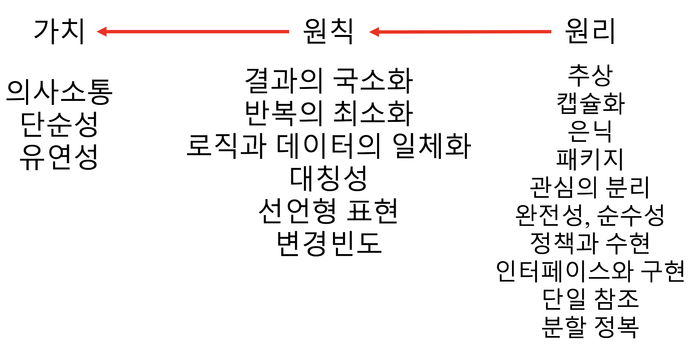
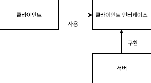

= 프로그래밍의 정석

=== 하필 이런 코드를 작성했나요?
* 자기가 짠 코딩에 대해 설명을 하지 못하면 편하게 산 게 아닐까?
* 코드 작성 이유에 대한 근거
** 취향 => 난 이게 좋아!
** 가치관 => 가치관이 옳은지에 대해 이야기함
** 지식 => 시대에 따라 통하지 않는 부분이 있을 수 있음
** 규칙 => 원래 이런 거야
** 결국 설득할 수 있는 건 **돈 = 시간 = 개발 + 수정**

=== 수정 시, 시간이 절약됨 
* 우호적 반발 => 팀 내부에서 발생
** 얼마나 수정된다고?, 급하니깐 일단 만들어!, 유지보수는 우리가 하지 않음
* 외적 사항
** 고객 요구사항, 투입 가능 자원, 일정 준수, 필수 구현사항, 프레임워크 및 언어
** 위원회 개발 => 일반적으로 이러한 사항들이 가고자 하는 방향이 다름
** 일관성 => 제일 좋은 방법은 설득을 통해 모든 포스를 모아서 하나의 방향(단일 책임)으로 향하게끔 하는 것이 좋음

=== 보다 구체적이고 강력한 방향성
* 원리 
** 설득받는 사람과 설득하는 사람의 학습, 지적 수준이 비슷해야 함
** 추상화하는 3가지 방법
*** 모델링 => 사상
*** 일반화 => 카테고리
*** 패키징 => 기준이 상황마다 다름
* 원칙
** 원칙을 지키면 즉시 예외상황에 대해 대처할 수 있음
** 선언형 => 일정 품질을 담보하는 대신, 팀원 전원을 멍청하게 만드는 단점이 있으니 적당하게 도입하는 것이 좋음
* 가치
** 역할 모델을 제대로 설계할 사람이 없다면 기능을 최소한, 단순하게 짜야됨

=== 철학
* 원리 => 원칙 => 가치로도 설득되지 않을 때, 철학까지 나오게 됨

|===
^| 합리주의 ^| 상대주의

^| 이성주의
^| 경험주의

^| 연역적 방법론
^| 귀납적 방법론

^| 기준 제시 
^| 상황 평가
|===

=== 의견 나눔
* 좋은 함수
** 제일 좋은 것은 인자를 넘기지 않은 함수
** 두 번째로 좋은 것은 인자를 한 개만 넘기는 함수
** 나쁜 함수는 인자 2개 이상 넘기는 함수
** 하지만, 지켜지기 힘드므로 최대한 좋은 함수를 짜려고 노력해야 함

* 이슈관리
* 새로운 기술에 대한 도입
** 전사 QA
** MSA => 우스갯소리로 개발자가 새로운 기술을 쓰고 싶어서 나온 기술이라는 이야기도 나옴

* DRY
** 절대 코드의 중복을 줄일 수 없음
** 켄트 백이 개발자 수준대로 중복이 보일 것이라고 말함
** 중복은 발견한 시점에서 바로 제거하는 것이 비용이 제일 쌈
** 애자일에서 리팩토링 하는 시점 = 기술부채 해결

* 오펜스, 디펜스
** 오펜스, 디펜스 인원을 섞어서 커뮤니케이션 문제가 없어야 함

* 기억이 나지 않는 순간 레거시 코드. 레거시 코드를 적대하는 의미로 쓰지 말자!

* 역할 모델을 설계할 수 있는 개발자를 찾자
** 찾지 못하면 내가 잘하는 개발자가 되자
** 내가 잘하는 개발자가 되지 못하면 단순하게 만들고
** 단순하게 만든 것들을 조립함

* 기능 단위로 다양한 추상화 레벨을 수행하지 말고 기저별, 응용별 레벨에서 분리가 중요함(코어, 유틸성 코드 등 분리를 말함)

* OCP 잘 이해하는 것은 확장이 쉽고 부분 개발이 쉬워진다는 것을 의미함

* 더블 디스패치
** 포인터의 포인터. 런타임에 무엇에 무엇을 가져와야만 알 수 있음
** http://wonwoo.ml/index.php/post/1490[토비의 봄 (더블 디스패치)]

=== 격리
* 이 책의 내용 기반은 
** 켄트 백의 구현 패턴
** 엔터프라이즈 애플리케이션 아키텍처 패턴
* 수정에 강하다는 것은 파일을 많이 건드리지 않고 컴파일을 많이 하지 않음

=== 격리할 때 주의점
* 너무 많이 격리하면 인터페이스끼리 상호작용할 수 없음
* 코드의 단순화 => OSI 7 Layer 
* 계층화 구조와 하드코딩으로 인해 IPv4 => IPv6 넘어가기가 쉽지 않음
* 미래를 바라보고 프로토콜 설계하기가 힘듦
* 자바 개발자는 기존 인터페이스를 새로운 요구사항이 들어온다면 상속받아서 새로운 인터페이스를 만듦 => 다중 상속의 문제점
** 격리 덕분에 프로젝트가 망하는 것이 아니라 어쭙잖게 프로토콜을 설계한 이유가 많음
* 격리가 심하면 심할수록 프로토콜 의존이 심함. 프로토콜이 많아질수록 비용이 많이 발생함
** 적당한 격리가 필요함

=== 인터페이스를 사용하면 어떤 효과를 볼 수 있나 ? => 결합도를 낮춤
* 더블디스패치
* 런타임에 객체를 바꿀 수 있음

=== 결합도
* 인터페이스를 통해 상호 작용함
* 결합도에 단계에 따라 각각 개선방안이 다름

===== 결합도 1단계 => 내용 결합
* 부모-자식 관계(=상속)이 내용 결합이라면 무조건 나쁜가?
* 상속 관계를 없애려면 역할 모델로 나눔
** is-a <==> has-a 
** 두 관계를 필요 때문에 왔다갔다하는 것이 좋은 것 같음
* 상황에 따라서 두 관계를 적절하게 사용하는 것이 좋음

===== 결합도 2단계 => 공통 결합
* 결합도 2단계인 공통 결합과 5단계 스탬프 결합의 단점을 커버하면서 개발하는 것이 좋음

===== 결합도 6단계 => 데이터 결합 
* 데이터 결합은 함수형 프로그래밍
* 5단계를 개선한다고 6단계가 되지 않음
* 참조의 단일성
* 프리미티브성
** 프리미티브성이 완전히 분리되어 있지 않음
** 플랫폼에 영향을 받는 때도 있고
** 언어마다 문자열을 값인지 객체로 처리하는지 Java에서 String 값이지만 StringLiteral은 싱글톤 객체임
* 계층 원리

=== 응집도
* 다른 코드의 도움을 받음

===== 응집도 6단계 => 정보적 강도
* 클래스는 정보적 강도를 가지고 있음

===== 응집도 7단계 => 기능적 강도
* 역할 기준으로 함수가 작성됨
* 역할을 기준으로 응집도가 높은 클래스를 만들었을 때 자주 변경되는 메서드와 잘 사용하지 않는 메서드를 같은 클래스에 두어야 하는가?
** 자주 변경되는 메서드가 변경될 때 잘 사용하지 않는 메서드를 항상 테스트해야 하는가?
** 잘 사용하지 않는 메서드의 참조 연관성 등을 다 확인해야 하는가?
* 하나의 역할을 수행하더라도 _변경 빈도, 사용 빈도_ 에 따라 클래스를 따로 만들 수도 있음
** 클래스의 메서드를 5개 이하로 분리함
** 정말 꼭 필요한 메서드 만을 뽑아내 그 정도 수정해야 하는 이유, 빈도, 역할이 같으면 하나의 클래스로 모음
* 객체 설계 5대 원칙
** 책 내용에서 20가지 나눴지만, 클래스의 기능을 기능적 강도로 5가지를 나눈 것

=== 직교성
* 직교성의 의미는 순수성이 가까움 => 모듈을 만들었을 때 사이드 이펙트가 발생하지 않음

=== 기타
* Java => 동적 디스패치
* 아토믹
* Swift => 값 지향 프로그래밍은 값 복사에 대한 비용이 많이 발생함
* https://www.slideshare.net/sunhyouplee/functional-reactive-programming-with-rxswift-62123571[Reactive Programming]
** Stream, Flow
** 지연 로딩을 알아야 함
** 제너레이터이나 코루틴 지원하는 언어 => C#
** 코루틴을 지원하지 않은 언어는 람다를 많이 사용해야 함
** Push에 반응하지 않고 Pull에 반응하도록 해야 함
** 일반적인 프로그래밍은 발산하려고 하지만, 
** 리액티브 프로그래밍은 원할 때마다 Pull을 하려는 이유는 Push(발산)를 관리
** 일방적인 통행이 아니라 쌍방향 통신을 위해 결론적으로 Flow 통제하기 위해서
** 동시성 프로그래밍, 병렬성, 병행성 프로그래밍
** 병행 패턴 중에서 서스팬드 패턴 있음
* 기저에 있는 레이어 => 몇 등성으로 정해야 하나 ?
* 좋은 환경에서 개발하지 못한다면 구현에 능한 개발자가 되어야 함

=== 실제 사례
* 이상적인 MVC 패턴
* 현실은 
** View, ViewController 끈끈한 상태 => 강력한 결합
** ViewController에 모든 처리가 있음 => 뭔일 있으면 나한테 다 던져봐 => Mediator 패턴
** ViewController 3000줄이 넘어감
** Model 역할도 충실하지 못함
** 개발자의 인지 과부하 문제 => 커뮤니티케이션 비용 증가함
** 화면 전이 때문에 코코아 프레임워크의 네비게이션 컨트롤러를 이용해야 함

===== 논의
* 스프링 Controller와 Dao에서 디커플링을 어떻게 할 것인가??
** 서비스 레이어를 추가하지만, 결국 결론이 달라지지 않음
** 초기 단계에 Controller과 Model을 코드에 옮기지 않으려고 노력함
** http://vandbt.tistory.com/13[OOD - 커플링이란 무엇이며, 어떻게 줄일 수 있을까?]
* Objective-C의 순환참조 자연스러움. 자바 또한 최근에 디스패치로 옮겨가면서 순환참조인지 판별하기 어려움

=== 아키텍처 선택의 기로
* 예측
** 각종 Features
** 퀄리티 향상에 대한 압박
** 비 기능 요구사항에 대한 대응
* 해결 => 인원을 대폭 늘림
* 개발능력 향상
** 3000줄 넘어가는 코드에 대한 추노
** 체력
* 못하는 것?
** 단일 책임의 원칙
** 인터페이스의 이해
** 많은 클래스 경험이 없음

=== VIPER 아키텍처 소개, 도입의 결과
* 많은 클래스가 동반함
* 단일책임의 원칙에 대한 개념을 몸으로 학습함
* 본인이 잘하는 부분만 하고 빠질 수 있음
* View, Presenter 접점이 생김

===== 논의
* 기능별 ? 도메인별로 팀을 나누느냐?
* 도메인별로 한 명씩 맡게 된다면 리스크 관리는 어떻게 할 것인가?
** https://brunch.co.kr/@hika/7[개발자의 효율성]

===== MVC, MVP
* MVC => Controller, Model 문제
* MVP
** View => set 메서드
** Presenter => View의 값을 갱신함
** View의 오류로 인해 Presenter도 오염이 됨
* https://academy.realm.io/kr/posts/eric-maxwell-mvc-mvp-and-mvvm-on-android/[안드로이드의 MVC, MVP, MVVM 종합 안내서]

=== 아키텍처는 발전해 나가는 것
* 아키텍처는 서비스에 맞게 개선해 나가는 것

===== 정리
* 책에서 5-7장 내용은 가볍게 읽어볼 만한 내용임. 1-4장까지 내용까지 정리함
* 다 이해하지 못하더라도 내가 당장 필요한 부분을 가져와서 적용해보려고 노력하자
* 코드 중복을 발견하는 즉시 제거함
* 문제에 대해 최소한 단위로 나누어 해결하고
* 기능은 최대한 단순하게 작성할 것
* 추상화 단계는 같은 수준으로 유지할 것
* 도메인 모델에 대해 찾아보게 됨
* 명명할 때, 루프백을 적용해보자!
* 결합도, 응집도에 관한 이야기를 주로 함
** 결합도는 낮게, 응집도는 높게
* 코드가 두번 이상 나온다면 함수로 분리함
* 함수가 많아지면 어떻게 묶을지 고민하는 시점부터 설계
* 추상화 수준을 나눔
** 의식적으로 나누는 연습을 많이 하고
* 다른 사람의 코드를 보면서 is-a <==> has-a 관계를 자유롭게 왔다갔다하면서 연습을 해봄