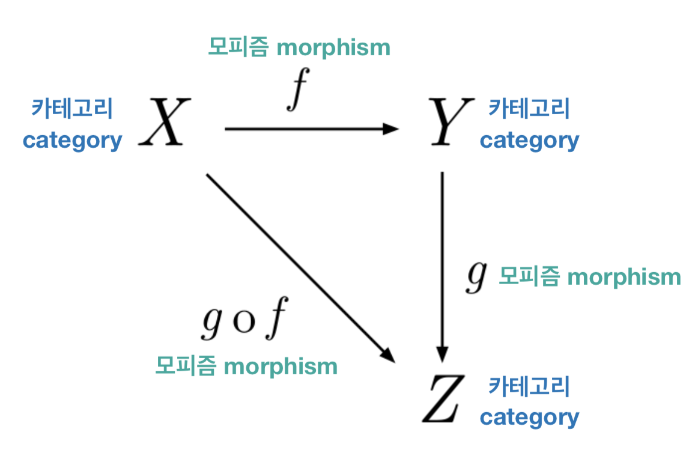
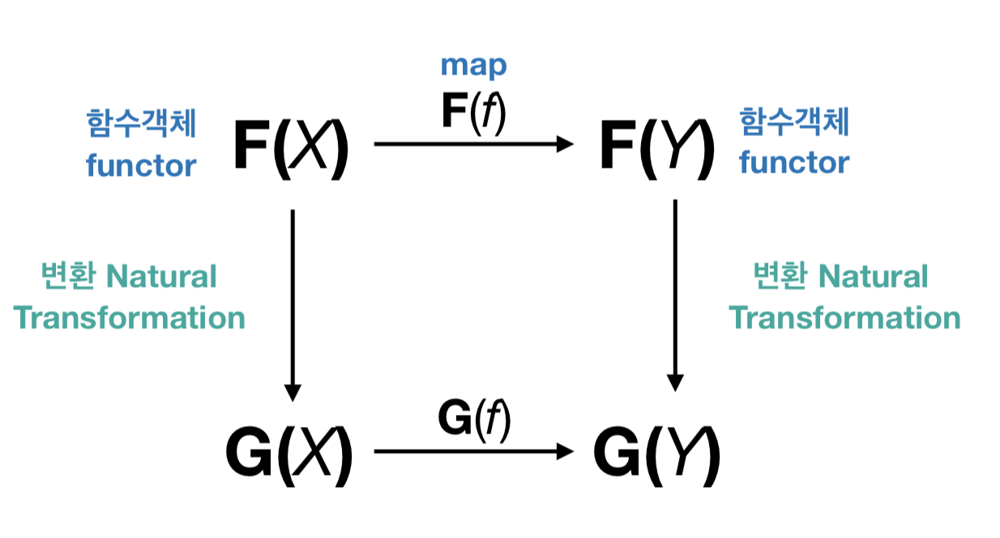
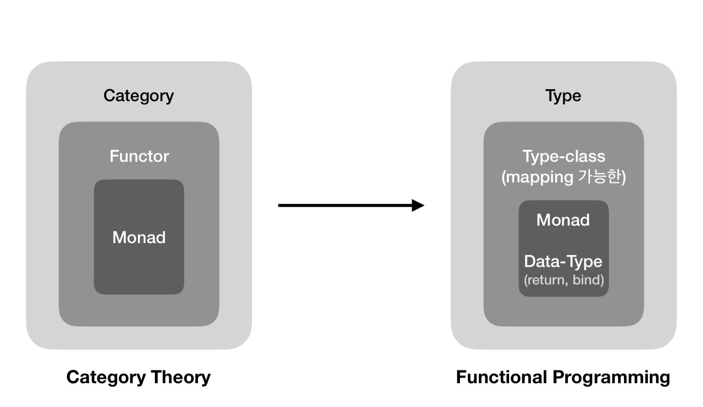
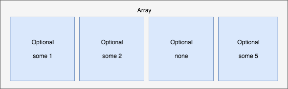
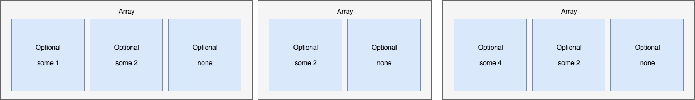

= Functor, Monad

=== Monad 수학적 개념

===== Human Computer
* 만유인력 법칙을 발견한 시대(17세기) 
* 손으로 수학 계산을 하던 사람들이 존재했음. 컴퓨터가 나오기 전까지 그 결과 값을 모아 파는 책이 있었음

===== 기계 컴퓨터
* https://ko.wikipedia.org/wiki/%EC%B0%B0%EC%8A%A4_%EB%B0%B0%EB%B9%84%EC%A7%80[Charles Babbage], https://ko.wikipedia.org/wiki/%EC%97%90%EC%9D%B4%EB%8B%A4_%EB%9F%AC%EB%B8%8C%EB%A0%88%EC%9D%B4%EC%8A%A4[Ada]
** 찰스 베비지가 계산이 가능한 기계, 최초 컴퓨터를 개발함. 공동 협력자로 에이다가 있었음
** 에이다는 Sub Routine, GOTO, 제어문 개념을 만듬

===== 두가지 패러다임
* https://en.wikipedia.org/wiki/Alonzo_Church[Alonzo Church] 
** Lambda Calculus
** 함수형 언어
* https://en.wikipedia.org/wiki/Alan_Turing[Alan Turing]
** Turing Machine
** 상태에 대한 기록, 기록을 저장할 수 있는 공간
** 절차식 언어, 객체지향 언어
* 전자 컴퓨터가 나오면서 패러다임과 함께 언어도 발전함
* 일반적으로 모던 언어는 객체 지향, 함수형 패러다임을 가지고 있음

===== 범주론(Category Theory)
* 수학 이론을 추상화함

===== 함수객체, 변환(Functor, Natural Transformation)
* 범주론을 한번 더 추상화함
* F(X)
** 함수객체, 함자
* F(X) -> G(X)
** 변환
* F(f)
** map

 

=== 함수형 프로그래밍(Functional Programming)

===== F(c) -> F(f) -> F(c) 
* 변환한 후 카테고리와 변환하기 전 카테고리가 같음
* Category = Type 
** String, Int
* Functor = Type-Class
** Mapping 가능한 
** 컨테이너 타입
** map 함수를 이용할 수 있음
** Swift에서 Collection Type, Optional이 있음
* Monad = Data-Type
** 구체적인 타입을 명시할 수 있음
** return
** bind 
*** `>>= 모나드 변수`
*** 원래 재귀형태로 구현해야 하지만 읽기 불편하여 체이닝 형태로 불러옴 
*** 절차식 프로그램처럼 실행되는 함수형 프로그래밍의 불편함을 해결하기 위해 모나드를 사용함

     

=== Swift Functor, Monad

===== Context
* 값이 있거나 없는 상태를 판별하는 기준 
** 기준에 따라 여러 모나드 중 어떤 것을 사용할지 판별함
** Maybe Monad, List Monad 등
* Optional은 some, none 두 가지 컨텍스트를 가짐
** .some(value) case 
*** 컨텍스트는 value를 가지고 있음
** .none case 
*** 컨텍스트는 있지만, value가 없음

===== Functor
* map 함수를 지원하는 컨테이너 타입
* map
** 컨테이너의 값을 변형시킬 수 있는 고차함수
** Swift Collection Type, Optional
** map(a -> b) -> f(a) -> f(b)
*** map(a -> b)
**** 함수로 인자를 받음
*** f(a)
**** 함수객체에 맵이 전달받은 함수 적용 => Optional(2)
*** f(b)
**** 결과 값을 컨텍스트에 넣어 반환하거나 함수를 실행하지 않고 빈 컨텍스트(nil)을 반환함(= 새로운 함수 객체를 반환함) => Optional(5) 또는 nil

===== Monad
* 값이 있을 수도 있고 없을 수도 있는 상태로 포장하는 타입
* 컨텍스트를 가진 타입
* Monad는 Functor의 한 유형
* flatMap
** map 함수와 비슷하게 동작하지만, 차이점은 flatMap함수는 내부에 포장된 값도 추출함
    

===== map, flatMap

[source, swift]
----
// Wrapped : 현재 컨테이너가 포함되는 엘리먼트 타입
// U : 반환될 컨테이너의 엘리먼트 타입
// map
public func map<U>(_ transform: (Wrapped) throws -> U) rethrows -> U?

// flatMap
public func flatMap<U>(_ transform: (Wrapped) throws -> U?) rethrows -> U?
----

=== 참고
* http://www.kyobobook.co.kr/product/detailViewKor.laf?ejkGb=KOR&mallGb=KOR&barcode=9791162240052&orderClick=LAH&Kc=[스위프트 프로그래밍:Swift4]