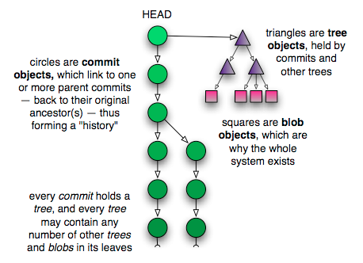

= Git 기본

=== Git  
* 분산 버전 관리 시스템 

=== Git 주요 명령어

===== _git init_
* 새로운 Repository를 만듬

===== _git clone <Remote-Repository-Host> <Directory-Name>_
* 원격 저장소를 복제 받아 로컬 저장소를 생성함

===== _git fetch_
* 원격 저장소의 변경사항을 가져옴

===== _git pull origin master_
* 원격 저장소의 변경사항을 가져와서(fetch), 로컬 저장소로 함침(merge)

===== _git add <File-Name or Directory-Name>_
* 새로 작업된 파일/디렉토리를 인덱스에 추가함
           
===== _git commit | git commit –m “이 커밋에 대한 설명”_
* 변경된 내용을 확정하여 지점을 만들고, HEAD에 반영함

===== _git commit –-amend_ 
* 최근 커밋의 내용(커밋 파일 추가 or 메시지 수정)을 수정하고 덮어씀

===== _git push | git push origin master_
* 원격 저장소로 반영함

===== _git stash_
* 워킹 디렉토리에 unstaged 파일들을 백업하고 워킹디렉토리를 깨끗한 상태 즉 HEAD의 상태로 만든다

[source, shell]
----
$ git stash save : 현재 작업을 저장하고 HEAD로 복원함
$ git stash list : 저장된 stash 목록을 보여줌
$ git stash pop : 가장 최근에 저장한 stash를 꺼내서 적용함
$ git stash apply : stash pop과 동일하지만 list에서 삭제하지 않음
$ git stash clear : 전체 stash 삭제
$ git stash drop : 필요없는 stash 삭제
----

===== _git status_
* 현재 저장소의 상태(브랜치 정보 및 commint/add 해야할 파일)를 확인함

===== _git branch_

[source, shell]
----
$ git branch <Branch-Name> : 현재 Repository에 새로운 브랜치 생성
$ git branch : 로컬 브랜치 목록 확인
$ git branch -r : 원격 브랜치 목록 확인
$ git branch –a : 로컬&원격 브랜치 목록 확인
$ git branch –d <Branch-Name> : 브랜치 삭제
----

===== _git checkout_

[source, shell]
----
$ git checkout <Branch-Name> : 브랜치 이동
$ git checkout –b <Branch-Name> :  브랜치 생성하고 해당 브랜치로 이동
$ git checkout <File or Directory Name> : 해당 파일 혹은 디렉토리를 마지막 커밋상태로 되돌림
$ git checkout <Commit-ID>  : 해당 커밋ID의 상태로 되돌림
----

===== _git reset_
* 특정 커밋을 취소함

[source, shell]
----
$ git reset –-hard <Commit-ID> : 커밋ID에 해당하는 커밋을 취소함
$ git reset –-hard HEAD^ : HEAD의 가장 최근 커밋을 취소함(복구불가)
$ git reset –soft HEAD^ : HEAD의 가장 최근 커밋을 취소험(복구가능)
----

===== _git revert_
* 기존의 커밋에서 변경한 내용을 취소해서 새로운 커밋을 만듬
* 되돌린 이력을 남기지만 되도록 쓰지 않는게 좋음

[source, shell]
----
$ git revert <Commit-ID> 
$ git revert HEAD : 가장 최근 커밋을 취소하고 새 커밋을 만듬
----

===== _git reset —hard_
* 버전을 되돌리지만, 되돌린 이력이 남지 않음. 되도록 쓰지 않는게 좋음

===== _git merge <Branch-Name>_
* 브랜치를 현재 브랜치로 합침
 
===== _git rebase <Branch-Name>_
* 브랜치의 변경사항을 현재 브랜치에 적용함

===== _git cherry-pick <Commit-ID>_
* 특정 하나의 커밋만 rebase함

===== _git log_

[source, shell]
----
$ git log -10 : 최근 10개의 커밋로그를 보여줌
$ git log –pretty=oneline : 한줄로 보여줌
$ git log --graph : 그래프 형태로 보여줌
$ git shortlog : 짧은 로그를 보여줌
----

===== _git reflog_
* 로컬에 작업된 커밋 로그을 보여줌

===== _git config_
* 전체 계정과 이름을 저장함

[source, bash]
----
$ git config --global user.name “이름”
$ git config --global user.email “이메일주소”
$ git config --global color.ui auto
----

* `--global` 옵션 없이 프로젝트 별로 다양한 설정을 지정할 수 있음
* 우선순위: 로컬 > 글로벌

[source, bash]
----
$ git config user.name
----

===== _git diff <File-Name>_
* 해당 파일의 로컬과 원격의 차이점을 보여줌

[source, bash]
----
$ git diff HEAD : 로컬 변경사항을 한눈에 볼 수 있음
----

===== _git remote_
* 원격 저장소 정보를 확인, 설정함

[source, bash]
----
$ git remote add origin master <Remote-Repository-Host> : 현재 로컬 저장소와 원격 저장소를 연결함
$ git remote show <Repository-Name> : 원격 저장소의 정보를 확인함
$ git remote rm <Repository-Name> : 원격 저장소를 제거함
$ git remote update : 원격 저장소 정보를 업데이트함
----

===== _git blame <File-Name>_
* 코드 라인별로 커밋ID 와 커밋한 사람등의 정보를 보여줌

[source, bash]
----
$ git blame –L 1, 10 <File-Name> : 1-10라인 정보를 보여줌
----

===== _git show_

[source, bash]
----
$ git show <Commit-ID> : 특정 커밋ID의 로그를 보여줌
$ git show <Branch-Name> : 특정 브랜치의 최근 커밋 로그를 보여줌
$ git show HEAD^ : 현재 브랜치의 최근 커밋 로그를 보여줌
----

===== _git submodule_
* 저장소 안에 또 다른 독립 저장소

[source, bash]
----
$ git submodule add <Remote-Repository-Host> <Directory-Name> : 새로운 서브모듈을 추가함
$ git submodule init : 서브모듈을 초기화함
$ git submodule update : 원격 저장소에서 Checkout받음
----

=== Git 실습

===== 새로운 로컬 저장소 만들기

[source, bash]
----
$ mkdir git-proj
$ cd git-proj
$ git status
$ git init .
$ git status
$ git log 
$ ls -al
----

===== 로컬 프로젝트 설정
* 우선순위: 로컬 > 글로벌

[source, bash]
----
$ cat .git/config
$ git config user.name
$ git config user.email
$ cat .git/config
----

===== Git Commit

[source, bash]
----
$ echo "some text" > text.txt
$ git status
$ git add text.txt
$ git status
$ git commit -m " Add text.txt"
$ git status
$ git log

##몇 번 반복해서 커밋
$ git log --oneline --decorate --graph
----

===== Git Push

[source, bash]
----
$ git push
----

=== Git 용어 설명

===== git 설정 
* 개발할 때, Working Directory를 건드리고 저장할 때 .git파일을 건드림
* '-' 단축옵션, '--' 진짜옵션
* commit객체를 제외하고 나머지 참조값

===== 워킹 디렉토리
* git의 작업 디렉토리를 나타내는 단어
* 작업 = 디렉토리 및 파일의 구조, 파일의 내용을 변경시키는 모든 행동
* git을 사용하지 않는 일반적인 모든 작업은 working tree에서 일어남
* `.git` 이라는 하위 디렉토리를 가지고 있는 디렉토리
* 하위 디렉토리와 그 안의 모든 파일을 포함함

===== 로컬 저장소
* 작업 디렉토리의 작업 변경 내용을 저장하는 곳
* 내 프로젝트 디렉토리 내에 숨김폴더(.git)로 저장됨

===== 원격 저장소
* 로컬 저장소를 서버에 복사해서 저장하는 곳
* 여려 명이 협업하기 위해서 필요하고 로컬 저장소가 없어졌을 때 복구하기 위해서도 필요함

===== 인덱스
* 작업 디렉토리와 로컬 저장소 사이에 위치
* 인덱스 또는 스테이징 에어리어
* 변경 내용을 먼저 인덱스에 추가해야 커밋할 수 있음
** 변경 내용 중 일부를 선택적으로 반영할 수 있기 때문임
* 즉, 인덱스에 있는 내용만 커밋 가능함

===== commit
* git의 객체(= Working tree의 스냅샷)
* commit 객체는 전세계적으로 다름(= 모든 커밋은 고유한 아이디를 갖음)
* 아이디는 긴 16진수인데 보통 앞의 5자리 정도만 사용해도 유니크함
* commit = 특정 시점 특정 PC의 working tree 내용
* commit은 하나 이상의 부모를 가질 수 있음
* commit은 결국 blob의 집합체
* `blob` 은 `tree` 로 관리됨
* git commit 엔터를 누른다면 현재 head에서 커밋 포인트를 만들고 head가 가르치고 있는 현재 branch로 갱신함. head가 가르키고 있는 branch가 없다면 branch 갱신하지 못함

===== branch
* 여러 커밋을 트리 형태로 관리할 수 있게 해줌
* 브랜치를 이용해 워크 플로우 관리를 쉽게 할 수 있음 
* 객체의 참조(= 세이브 포인트의 참조)
* 현재 브랜치 = HEAD
* HEAD 브랜치에서 새로운 커밋이 생성되면 브랜치도 함께 갱신됨

===== HEAD
* 마지막 커밋의 참조
* HEAD가 브랜치에 속해 있지 않을 때 `detached HEAD` 라고 함
* 다음 커밋의 부모
* `^` 현재 커밋의 부모
* `^2` 현재 커밋의 두번째 부모
* `^^` = ~2 할아버지

```
G   H   I   J (부모 = 오래된 커밋)
 \ /     \ /
  D   E   F
   \  |  / \
    \ | /   |
     \|/    |
      B     C
       \   /
        \ /
         A (자손 = 최신 커밋)

A =      = A^0
B = A^   = A^1     = A~1
C = A^2  = A^2
D = A^^  = A^1^1   = A~2
E = B^2  = A^^2
F = B^3  = A^^3
G = A^^^ = A^1^1^1 = A~3
H = D^2  = B^^2    = A^^^2  = A~2^2
I = F^   = B^3^    = A^^3^
J = F^2  = B^3^2   = A^^3^2
```

===== origin
* 기본으로 정해지는 원격 저장소 이름, 바꿀 수 있음
* 다른 원격 저장소를 다른 이름으로 추가할 수도 있음

===== upstream, fork
* github의 fork기능을 이용하면 다른 계정의 저장소를 복사해 올 수 있음
* 이 경우 일반적으로 내 저장소(쓰기 권한 있음)는 `origin`
* fork의 대상이었던 저장소(읽기 전용)는 `upstream`

===== master
* 가장 기본이 되는 브랜치 실제 서비스 
* 운영시에는 보통 가장 최근의 실배포 내용만 적용됨
* 마스터 브랜치에서는 작업을 하지 않는게 좋음

===== checkout
* head에서 해당 브랜치의 주소를 가리킴
* 현재 워킹트리를 특정 커밋(또는 브랜치)으로 되돌릴 때 사용함
* checkout을 하면 인덱스와 워킹트리 모두 바뀜

===== tag
* 태그도 참조의 일종
* 태그는 갱신되지 않음
* 태그와 브랜치 이름을 같게 하면 위험 => 배포파일에 버전을 붙일 때 사용함. branch 이름과 중복되면 안됨

===== push
* 특정 브랜치를 커밋할 때, 연결된 커밋 내역들만 원격서버에 반영됨

===== merge
* 한 브랜치를 다른 브랜치로 합칠 때 사용(= 다른 브랜치를 하나의 새로운 commit으로 합침. 따라서 부모가 두개)
* 최근에는 코드리뷰와 함께 진행하는 경우가 많음
* github의 pull request, git의 request-pull 기능 참조

===== reset, revert
* reset과 revert 는 모두 이전 커밋으로 되돌릴 때 사용함
* reset => 이전 커밋이 참조 리스트에서 사라짐
** soft => HEAD만 이동
** mixed => HEAD 이동, 인덱스 내용 변경
** hard => HEAD 이동, 인덱스 내용 변경, 워킹트리 변경
* revert => 이전 커밋은 남아있고 새로운 커밋을 만듬

===== rebase
* 현재 브랜치와 다른 브랜치와이 차이를 현재 브랜치에 반영시킴(= 로컬에서만 사용하는 것이 좋음. 두 브랜치의 차이를 밝혀서 한 브랜치로 만들어줌)

===== git rebase -i
* 에디터를 이용해 직접 커밋의 순서 등을 조정할 때 사용함

===== cherry-pick
* 특정 커밋만을 가져오고 싶을 때 사용

===== stash
* 인덱스와 워킹트리의 내용을 임시 저장
* 단 untracked 파일은 건드리지 않음

===== Git이 만약 부모노드에서 자식노드로 합쳐진다면 ?
* 부모 노드가 자식 노드으로 합쳐질 경우 부모 노드에서도 수정이 빈번히 일어나게 되므로 문제가 발생하기 때문에 자식노드가 부모 노드로 합쳐짐

=== blob

===== blob
* git은 같은 내용의 파일이 여러 개 있어도 중복 저장하지 않음

[source, bash]
----
$ mkdir sample; cd sample
$ echo "Hello" > hello.txt
$ echo "Hello" > greeting.txt
$ git hash-object hello.txt
ce013625030ba8dba906f756967f9e9ca394464a
$ git hash-object greeting.txt
ce013625030ba8dba906f756967f9e9ca394464a
----

===== git blob
* git은 결국 blob을 관리하는 프로그램

[source, bash]
----
git init
git add .
git commit -m "Init & Add hello"
git cat-file -t ce013
git cat-file blob ce013
----

=== Tree

===== tree 확인

[source, bash]
----
$ git log
$ git rev-parse HEAD
$ git ls-tree HEAD
$ git cat-file -t HEAD
$ git cat-file commit HEAD #tree id check
$ git ls-tree TREEID

$ find .git/objects -type f | sort
$ git cat-file -t HASH1..3 #repeat 3 times
$ git show HASH1..3
----

===== tree 만들기

[source, bash]
----
$ rm -rf .git *.txt
$ echo "hello" > hello.txt
$ echo "hello" > greeting.txt
$ git init
$ git add .
$ git log
$ git status
$ git ls-files --stage
$ git write-tree
$ echo "Init" | git commit-tree TREEID
----

===== tree로 부터 commit 하기

[source, bash]
----
$ git update-ref refs/heads/master COMMITID
$ git symbolic-ref refs/heads/master
$ git log
----



=== 참고
* https://github.com/honux77/practice/wiki/learngit[Git 참고(honux77 Github)]
* https://backlog.com/git-tutorial/kr/intro/intro1_1.html[누구나 쉽게 이해할 수 있는 Git입문]
* https://learngitbranching.js.org/[Learn Git : Git 사용을 연습해볼 수 있는 곳]
* http://rogerdudler.github.io/git-guide/index.ko.html[git - 간편 안내서]
* https://backlog.com/git-tutorial/kr/stepup/stepup1_5.html[토픽 브랜치와 통합 브랜치에서의 작업 흐름 파악하기]
* http://danielkummer.github.io/git-flow-cheatsheet/index.ko_KR.html[git-flow cheatsheet]


