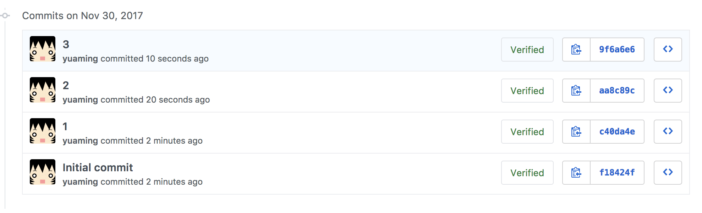
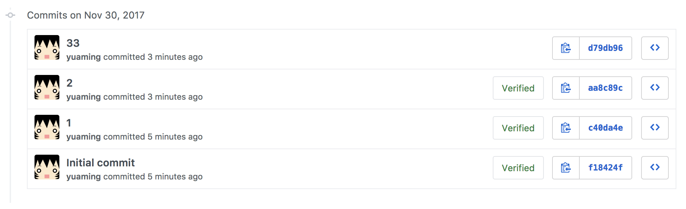
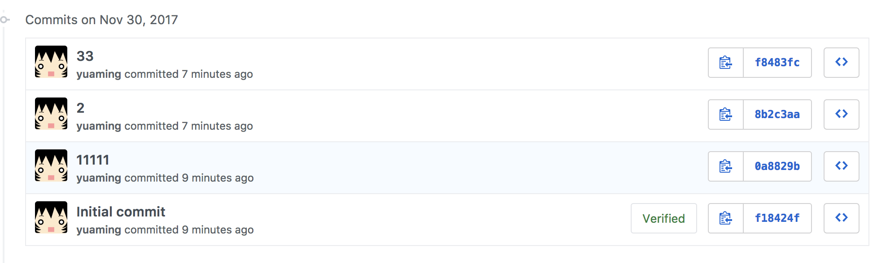

= Git Rebase -i를 이용하여 Git Commit 메세지 변경하기

===== 문제
* Git Commit 메세지를 변경하고 싶은데 어떻게 해야 할까?

===== 해결
* 마지막 커밋 메세지를 "3" -> "33" 으로 바꾸고 싶음
* 아래 이미지와 같이 커밋 내역이 있음

[source, shell]
----
# amend를 이용해서 메세지를 바꾸면 git commit id도 바뀜
# 보이지 않지만 커밋내역이 저장소 어딘가에 쌓이고 있음

$ git commit --amend -m "33"

$ git push -f
----

* 아래에서 두 번째 커밋 메세지를 "1" -> "1111"으로 바꾸고 싶음

[source, shell]
----
yuaming@yuaming-pc � ~/dev/workspace/rebase-test � � master � git rebase -i HEAD~3

yuaming@yuaming-pc � ~/dev/workspace/rebase-test � ? c40da4e >R> � git commit --amend
----

[source, shell]
----
# edit 설정 후, vi로 원하는 메세지를 수정함
edit 0a8829b 1
pick 8b2c3aa 2
pick f8483fc 33

# Rebase f18424f..f8483fc onto f18424f (3 commands)
#
# Commands:
# p, pick = use commit
# r, reword = use commit, but edit the commit message
# e, edit = use commit, but stop for amending
# s, squash = use commit, but meld into previous commit
# f, fixup = like "squash", but discard this commit's log message
# x, exec = run command (the rest of the line) using shell
# d, drop = remove commit
#
# These lines can be re-ordered; they are executed from top to bottom.
#
# If you remove a line here THAT COMMIT WILL BE LOST.
#
# However, if you remove everything, the rebase will be aborted.
#
# Note that empty commits are commented out
----

[source, shell]
----
yuaming@yuaming-pc � ~/dev/workspace/rebase-test � ? 0a8829b >R> � git rebase --continue

Successfully rebased and updated refs/heads/master.

yuaming@yuaming-pc � ~/dev/workspace/rebase-test � � master � git push -f 
----

* "11111", "33"으로 변경된 메세지를 확인할 수 있음

=== 참고
* https://help.github.com/articles/changing-a-commit-message/[Git Commit 메세지 변경]
* https://git-scm.com/book/ko/v1/Git-%EB%8F%84%EA%B5%AC-%ED%9E%88%EC%8A%A4%ED%86%A0%EB%A6%AC-%EB%8B%A8%EC%9E%A5%ED%95%98%EA%B8%B0[Git 도구 - 히스토리 단장하기]