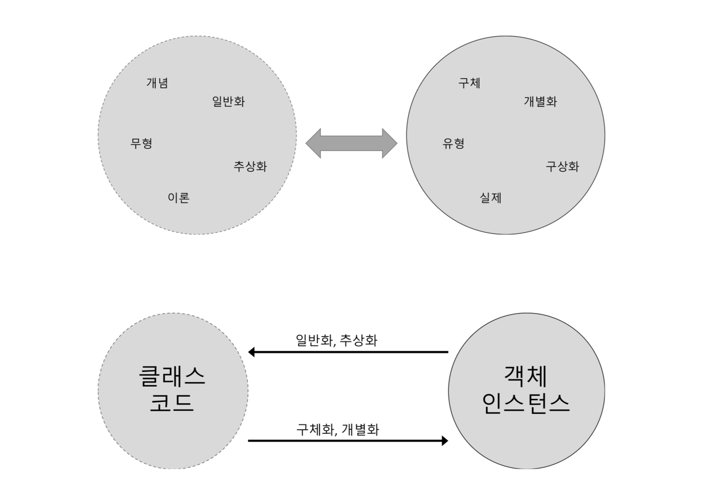
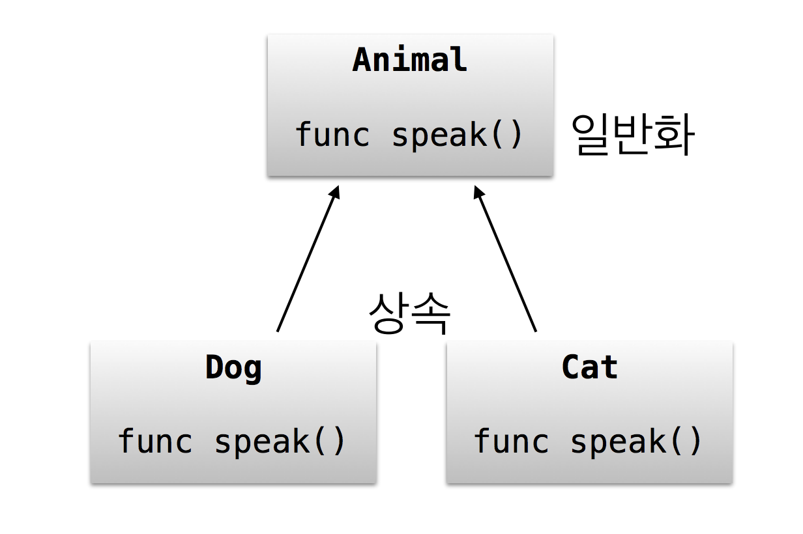
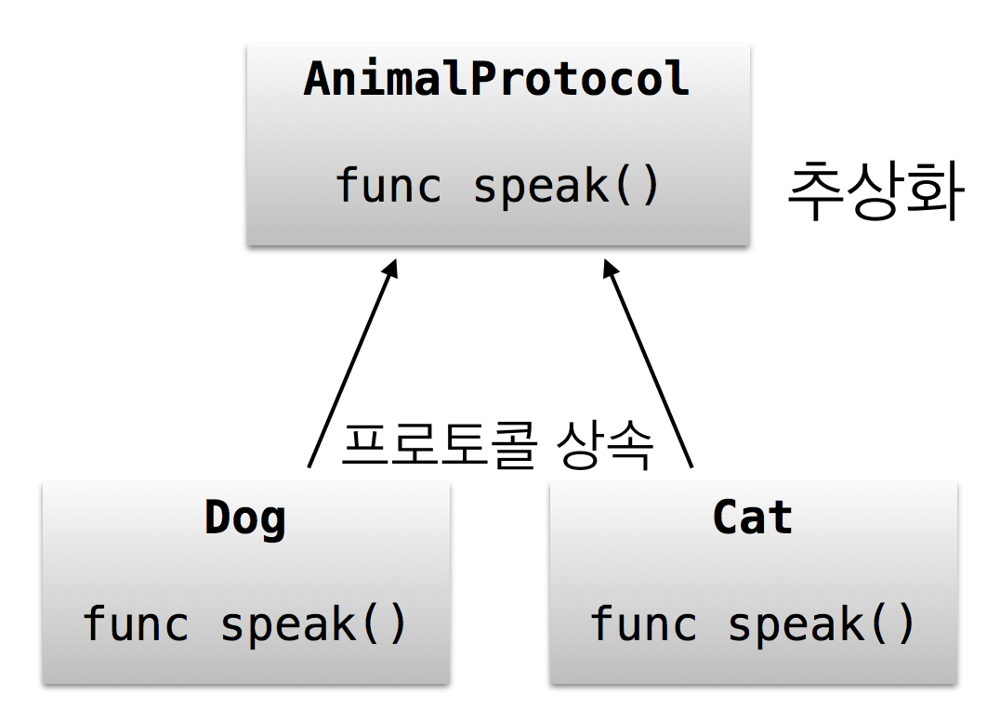

= 객체 지향 프로그래밍(Object-Oriented Programming with Swift)

=== 객체 지향 프로그래밍
* 객체
* 추상화, 참조
* 프로퍼티와 메서드(Property, Method) 
* 클래스 객체와 객체 인스턴스(Class, Instance)
* 캡슐화(Encapsulation)
* 상속(Inheritance)
* 다형성(Polymorphism)
* 객체 설계 5원칙
* 객체 디자인 패턴

=== 객체
* 주체의 반대말

=== 추상화, 참조
* 추상화
** 값이 사라짐
* 참조
** 값이 사라지지 않고 전달됨
* 객체를 잘 짜기 위해서 _SOLID 원칙_
* Swift 기준, 객체를 struct나 class로 구현여부에 대해서 기준이 필요함

==== 클래스와 객체 인스턴스
* `var myPen = NSPen()`
* 클래스
** 선언문
* 객체 인스턴스
** 선언한 클래스가 메모리 공간에 올라감

* 객체지향의 철학
** 객체가 무엇을 처리할지 알지 않아도 됨. 컴파일 단계에서 확인함
** 하지만, 그렇지 않은 언어도 있음

==== 구조체, 클래스

===== 구조체 => 데이터 추상화 => 결론적으로 **관련 데이터를 한꺼번에 모아놓기 위한 것**
* 값을 저장하기 위한 _프로퍼티, 멤버변수_ 선언
* 기능을 제공하기 위한 _메서드_ 선언
* 서브스크립트로 접근할 수 있는 문법 지원
* 초기 상태를 위한 초기화 메서드 제공
* Milk => 추상화, 일반화를 통해 코드로 표현
* 수학적으로 https://gamecodingschool.org/2008/04/03/%EC%B9%B4%ED%85%8C%EA%B3%A0%EB%A6%AC-%EC%9D%B4%EB%A1%A0category-theory/[카테고리 이론], https://gamecodingschool.org/tag/%ED%83%80%EC%9E%85-%EC%8B%9C%EC%8A%A4%ED%85%9C/[타입 이론]이 존재함

[source, swift]
----
// 우유 객체 구조체
enum MilkType {
    case Blueberry
    case Banana
    case EnergyChoco
}
struct Milk {
    let brand : String
    let amount : Int
    let title : String
    let type : MilkType
}

// 우유 객체 인스턴스
let berryMilk1 = Milk(brand: "서울우유", amount: 150, title: "블루베리우유", type: .Blueberry)

let bananaMilk1 = Milk(brand: "서울우유", amount: 150, title: "바나나우유", type: .Banana)

let chocoMilk1 = Milk(brand: "서울우유", amount: 150, title: "에너지초코우유", type: .EnergyChoco)
----

===== 구조체와 클래스 비교
[options="header"]
|===
| 구조체 | 클래스
^| 공통점 | 프로퍼티에 값을 저장할 수 있음, 함수로 원하는 기능을 제공할 수 있음, 서브스크립션으로 값에 접근할 수 있음, 초기값을 위해 생성함수를 정의할 수 있음
^| 상속 불가 ^| 상속 가능
^| - ^| 소멸함수에서 불필요한 리소스 해제
^| 의미 있는 값(= Value Sementic, Direct) ^| 의미 있는 참조(= Reference Sementic, Indirect)
^| - ^| 인스턴스 참조별 개수 관리 필요 
|===

===== 구조체와 클래스 나누는 기준을 참고할만한 자료
* http://egloos.zum.com/aeternum/v/1105776[Value Object, Reference Object]

==== 캡슐화
* 인터페이스를 통해서 값을 주고받음
* 정보 감추기 + 정보 접근 메서드로 추상화함
* 객체 외부에서 값이 변경되면 위험함
* 속성에도 객체가 올 수 있고, 관계가 생길 수 있음

==== 접근제어

===== module
* 배포할 코드의 묶음 단위
* 하나의 프레임워크, 라이브러리, 애플리케이션 등 모듈 단위가 될 수 있음

===== 소스파일 
* 소스 코드 파일

===== private
* 기능 정의 내부
* 기능 단위로 구현할 때 사용하길 권장함

===== fileprivate 
* Swift4에서 같은 파일 안에서 private 선언하면 fileprivate으로 동작함

===== internal
* target(= module) 내부
* Swift에서 접근제어를 명시하지 않으면 `internal` 이 기본임

===== public
* 모듈 외부
* 주로 프레임워크에서 외부와 연결될 인터페이스 구현

===== open
* 모듈 외부
* 클래스, 클래스 멤버에서만 사용 가능
* 해당 클래스를 다른 모듈에서 부모 클래스로 사용하겠다는 목적

==== 상속
* 클래스 상속
** 서브클래스가 상속받으면 슈퍼클래스에서 선언한 부분을 서브클래스에서 구체적인 동작으로 구현해야 함
** 애플 문서에서 상속 관계를 슈퍼클래스, 서브클래스로 주로 사용함
** 포함 관계에서 부모클래스, 자식 클래스를 많이 사용함
** 클래스 다중 상속은 지원 안 함. 프로토콜(인터페이스) 다중 상속을 지원함
** https://developer.apple.com/documentation/swift/memorylayout[Memory Layout]

[source, swift]
----
class Milk {
    var brand : String
    var amount : Int
    var title : String
    var type : MilkType

    init() {
        brand = ""
        amount = 0
        title = ""
        type = .unknown
    }
}

class ChocoMilk : Milk {
    override init() {
        super.init()
        type = .energyChoco
    }
}

class BananaMilk : Milk {
    override init() {
        super.init()
        type = .banana
    }
}

let bananaMilk1 = BananaMilk()
let chocoMilk1 = ChocoMilk()
----

==== 다형성

===== 클래스 상속

[source, swift]
----
class Animal {
    func speak() {
    print("animal speak...")
    }
}

var animal = Animal()
animal.speak()

class Dog : Animal {
    override func speak() {
        print("dog - bow-wow")
    }
}

class Cat : Animal {
    override func speak() {
        print("cat - meow")
    }
}

var dog = Dog()
dog.speak()
var cat = Cat()
cat.speak()

// 상속을 이용하여 다양하게 표현할 수 있는 부분을 다형성이라고 함
// swtich-case 문으로 타입을 확인하고 as 연산자로 타입캐스팅 할 필요가 없음
var animalArray : [Animal] = [animal, dog, cat]
for x in animalArray {
    x.speak() 
}
----

===== 구조체는 다형성을 어떻게 사용할까?

[source, swift]
----
protocol AnimalProtocol {
    func speak()
}

struct Animal: AnimalProtocol {
    func speak() {
        print("animal speak")
    }
}

var animal = Animal()
animal.speak()

struct Dog : AnimalProtocol {
    func speak() { print("dog - bow-wow") }
}

struct Cat : AnimalProtocol {
    func speak() { print("cat - meow-meow") }
}

var dog = Dog()
dog.speak()
var cat = Cat()
cat.speak()

var animalArray : [AnimalProtocol] = [animal, dog, cat]
// LSP : 서브타입은 (상속받은) 기본 타입으로 대체 가능해야 함
for x in animalArray {
x.speak()
}
----

===== Swift에서 다형성을 적용하는 기준
* 프로토콜 
** 구현체가 다르고 호스트 코드에서 호출하는 메서드가 같을 때(=시그니처가 같을 때) 프로토콜을 사용함
* 제네릭
** 로직이나 알고리즘이 같고 여러 타입일 때 제네릭이 좋음
* 상속 
** 똑같은 프로퍼티(var, let)나 메서드이 있을 때 공통 속성으로 뽑아서 사용함
* 자기만의 기준을 세우는 것이 중요함

==== http://www.nextree.co.kr/p6960/[객체 설계 5원칙(SOLID)]

===== 단일 책임의 원칙(SRP)
* 객체는 하나의 역할과 책임을 가짐
* 객체를 하나의 역할로 나누는 기준을 생각하는 것이 어려움

[source, swift]
----
// before
struct InputView {
    func readInput() {
        print("실행 좌표를 입력하세요.")
        let userCoordinate = readLine()
        guard let input = userCoordinate else { return }
        print(seperateCoordinates(userInput: input))    
    }

    // ...
}

// after
struct InputView {
    func readInput() -> String {
        print("좌표를 입력하세요.")
        let userCoordinate = readLine()
        guard let input = userCoordinate else { return "" }
        return input
    }

    // ...
}
----

===== 개방폐쇄의 원칙(OCP)
* 변경에 닫혀 있어야 하고 확장하는 것에 열려있어야 함
* 잦은 수정보다 확장할 수 있는 것이 좋음

===== 리스코브 치환의 원칙(LSP)
* 서브타입(상속받은)은 기본타입으로 대체 가능해야 함
* 즉, 하위 클래스를 사용하는 것보다는 상위의 클래스(인터페이스)를 사용하는 것이 더 좋음

===== 의존성 역전의 원칙(DIP)
* 의존적인 객체가 존재한다면 관계를 느슨하게 바꾸고 밖에서 주입해야함

[source, swift]
----
class MessageListViewController: UITableViewController {
    private let loader: MessageLoader

    // 객체가 가지는 의존성을 외부에서 주입하면
    // 의존성 여부가 명확해지고
    // 단위 테스트하기 편함
    // 의존하는 객체 타입 대신 프로토콜을 채택한 객체를 넘겨줌
    // 싱글톤 객체인 경우, 싱글톤을 대체할 수 없음 => 싱글톤 객체를 대체할 수 있는 프로토콜을 정의할 수 있으면 좋음
    // 하나의 인터페이스가 커지면 분리하는 것이 좋음 => 인터페이스 분리의 원칙
    init(loader: MessageLoader) {
        self.loader = loader
        super.init(nibName: nil, bundle: nil)
    }

    override func viewWillAppear(_ animated: Bool) {
        super.viewWillAppear(animated)

        loader.load { [weak self] messages in
            self?.reloadTableView(with: messages)
        }
    }
}
----

===== 인터페이스 분리의 원칙(ISP)
* 한 클래스에 사용하지 않는 인터페이스는 구현하지 않음
* 즉, 의미와 목적에 맞는 프토토콜을 분리해야 함
** 인터페이스를 나눌 때 메서드와 프로퍼티를 선택해야 하는 경우가 생김.이 때 메서드로 선택하는 것이 좋음 
** 프로퍼티로 선택하면 private 접근자 제어를 사용할 수 없어 값이 오픈됨
** 계층화된 속성은 클래스를 이용함

==== 객체관계

===== 포함관계, 상속관계는 코드의 재사용성이 공통점

===== 포함관계(Composition, HAS-A)
* 특정 기능의 개체를 가지는 것

===== 상속관계(Inheritance, IS-A) 
* IS-A
** 부모에서 구현된 멤버가 자식 클래스를 통해 노출되는 것
** UI 컴포넌트가 좋은 예임 
** 클래스와 인스턴스 관계, 해당 타입으로 바꿀 수 있는가 ?
* AS-A 
** 서브클래스와 슈퍼클래스 관계, 상속 관계로 바꿀 수 있는가 ?

===== 일시적 참조관계(Reference)
* 소유권은 누구에게 가지고 있어야 하는지 명확해야 함
* 제대로 관리하지 못하면 버그 덩어리가 됨

===== 객체 그래프(Object Graph)
* 객체 참조 관계를 나타냄 
* 객체 상속관계는 클래스 다이어그램으로 표현함 

===== http://jwchung.github.io/%EC%83%81%EC%86%8D%EC%9D%80-%EC%BD%94%EB%93%9C-%EC%A4%91%EB%B3%B5%EC%A0%9C%EA%B1%B0%EB%A5%BC-%EC%9C%84%ED%95%9C-%EC%B5%9C%ED%9B%84%EC%9D%98-%EB%B3%B4%EB%A3%A8[상속을 중복코드 제거를 위한 최후의 보루라고 생각하고 protocol, extension이나 HAS-A 관계로 문제를 해결하려고 노력해야 함]