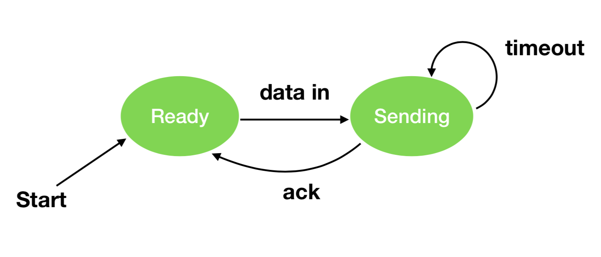
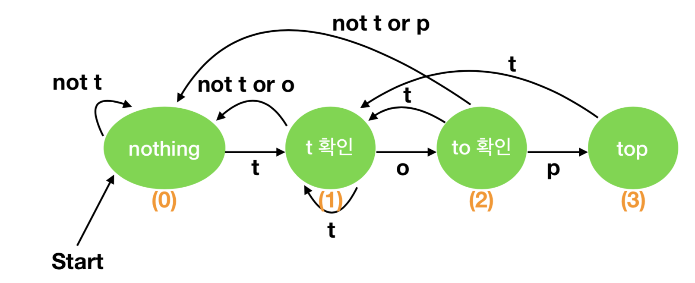
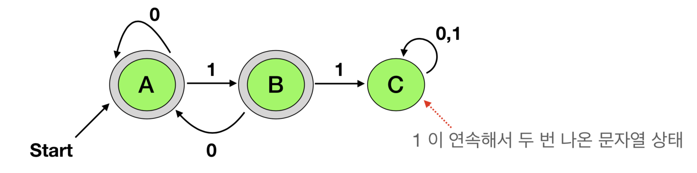
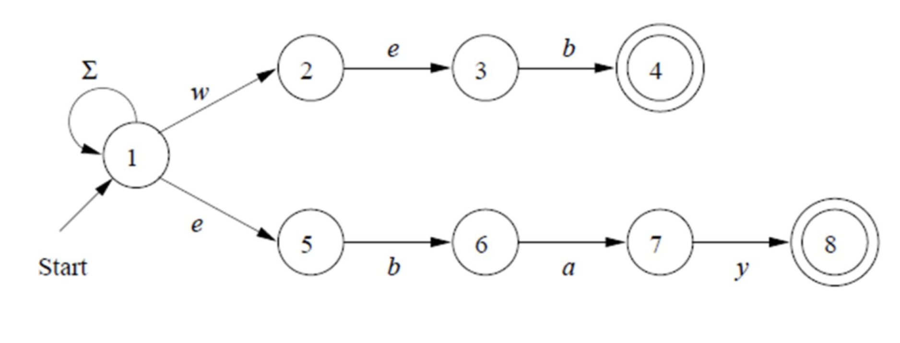
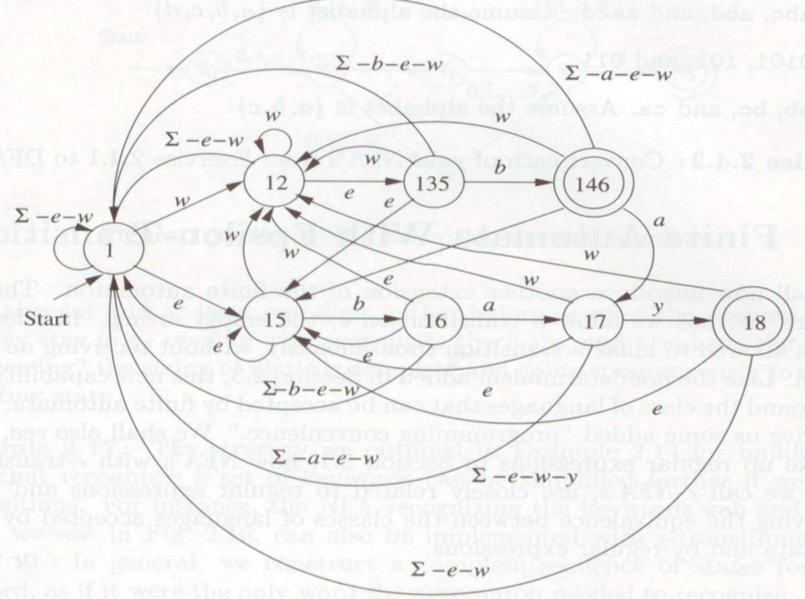

= 오토마타(Automata)

=== JSON 문자열 분석기

===== 출제의도
* 개념 + 방식 
** 알고리즘 + 지식, 디자인 패턴 + 원리
* 코딩 + 사용법 
** Stackoverflow, Demo, Sample, Github
* How
** 개념 + 방식 -> 코딩 + 사용법
* Why 
** 코딩 + 사용법 -> 개념 + 방식
* 두 가지 사이에서 How, Why 사이클 한번 돌려야 자기 것이 됨

=== 오토마타 이론
* 상태(State)의 유한한 집합
* 주어진 규칙에 따라 특정 상태에서 다른 상태로 전이

===== 유한 오토마타 표현
* 그래프 방식으로 오토마타를 이해하기 쉬움
* 상태 
** 노드
* 상태 전이 함수
** 화살표

===== 문자열 인식
* "top" 확인
** "t" 이면 "o"로 상태 전이, 아니라면 Nothing
** "to" 이면 "p"로 상태 전이, 아니라면 Nothing

===== 유한한 집합 예시
* 알파벳
** 유한한 심볼 집합
** ASCII코드, 유니코드, 이진코드 {0, 1}
* 문자열(Strings)
** 알파벳을 조합해서 만들 수 있음
** { 0, 1 } * = { ?, 0, 1, 00, 01, 10, 11, 000, 001, ... }
** ∑ * 은 문자열 집합
** ? 공백
* 언어(Languages)
** 특정 알파벳 집합으로 만들 수 있는 하위 집합

===== DFA
* 유한 오토마타 중 하나
* 상태가 전이하고 실패하거나 성공하는 경우를 다 생각해야함

===== DFA 그래프 표현
* 상태
** 노드
* 상태 전이 함수
** 화살표
* 시작상태
** 화살표가 가리키는 상태
* 죄종상태
** 이중 동그라미

===== DFA 전이표
* 그림으로 관리하기 힘들어지면서 표로 만듬

===== 확장 상태 전이함수
* 입력이 문자열인 경우, 문자 하나씩 처리하여 최종상태에 도달
* 프로그래밍으로 하나씩 문자열을 비교하는 것이랑 같음

===== DFA 언어
* 모든 오토마타는 `언어를 정의함`
* 수학적 귀납법으로 증명할 수 있음

===== 정규 언어
* 수학적 귀납법으로 증명할 수 있음

===== NFA
* 프로그래밍으로 구현할 수 없음
** 상태 전이가 일어나는 경우가 생각하기 때문임
* NFA로 먼저 계획하고 DFA로 구현함

===== NFA 특징
* 파이널 오토마타는 동일함

===== NFA와 DFA 비교
* NFA
** 그래프 단순

* DFA 
** 그래프 복잡

===== 한글 조합 오토마타
* DFA

===== https://ko.wikipedia.org/wiki/%EC%B4%98%EC%8A%A4%ED%82%A4_%EC%9C%84%EA%B3%84[놈 촘스키 형식언어 계층]
* 개발자가 다루는 프로그래밍 언어는 문맥자유문법
* 문자열은 정규 언어
** 정규 언어를 구현한 문법(Regular Grammar) 

=== 정규표현식(Regular Expression)
* 정규 언어를 기술한 수학적 표현
* 정규 표현식 E이라면 L(E)은 E를 정의하는 언어
* 수학적 기본식
** a가 임의의 심볼이고 a가 RE이라면 L(a) = {a}
** ?가 RE이라면, L(?) = {?}
** ? 가 RE이라면, L(?) = {?}
* 유도식은 문자열을 생각하면 쉽게 추론할 수 있음

===== 정규표현식 예시
* 괄호가 있으면 괄호가 우선
* Closure(*)가 Union(+)보다 우선

===== 정규표현식과 오토마타
* _RE, Automata는 Equivalent_
** 모든 RE에 대해서 같은 언어를 만족하는 오토마톤 구성 가능
** 오토마톤이 주어지면 같은 언어를 만족하는 RE 구성 가능
* _RE와 Automaton의 상호 변환_
** RE → e-NFA → NFA → DFA 순서로 생성 가능
** DFA → NFA → e-NFA → RE 순서로 생성 가능

===== 정규표현식 패턴
* 프로그래밍에서 정규표현식 수학적 규칙보다 더 많은 것이 필요하므로 확장되었음
* 언어마다 지원하는 패턴은 조금씩 다름

=== Scanner & Parser

[source]
----
["a", "b"]

// Lexical Analyzer
// [, a, ,, b, ]
// 컴파일러가 문자열을 자름
// Syntax Analyzer
// 컴파일러 문자뿐만 아니라 문법까지 확인함
----

===== http://untitledtblog.tistory.com/9[컴파일러 구조]
* Parser
** 문자열을 자르고 구문도 확인함
* Scanner
** 문자열을 자름

===== Lexer Generator Lex
* Lexer 
** 자른 문자열
* Lex
** 프로그래밍 언어
* 자른 문자열을 통해 내가 사용하는 프로그래밍 언어로 생성함

===== Parser Generator Yacc
* 구문을 통해 C언어로 생성함