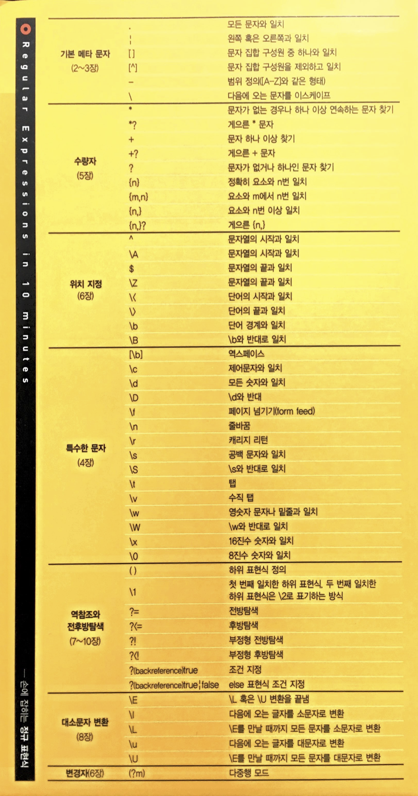

= 정규표현식(Regular Expression)

=== 참고
* https://regex101.com/[Regular Expression 101]
* https://regexper.com/[regexper]
* https://en.wikipedia.org/wiki/Regular_expression[Regular Expression Wikipedia]