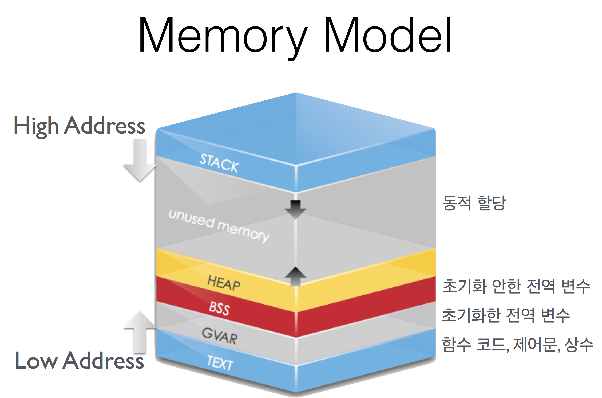
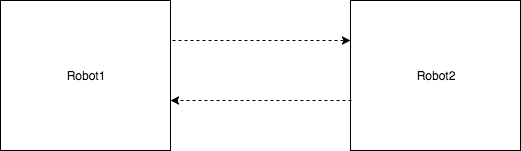
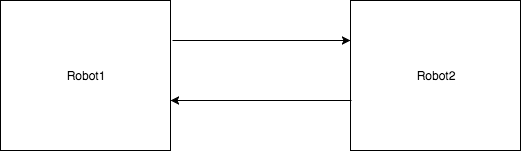
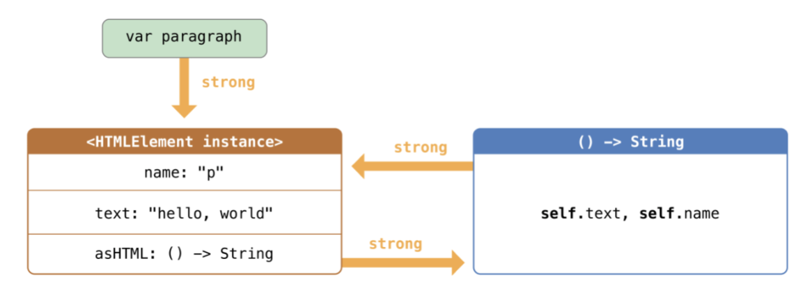

= Memory

=== Value, Reference

===== Value Type

[source,swift]
----
let origin = CGPoint(x: 0, y: 0)
// let orgin = CGPoint.init(x: 0, y: 0)과 같음
var other = origin
other.x += 10
// Call By Value -> 값이 복사됨

// origin -> (0, 0)
// other -> (10, 0)
// Value semantics
----

===== Reference Types

[source,swift]
----
var myMilk = ChocoMilk()
myMilk.amount 300

var yourMilk = myMilk
yourMilk.amount = 300
// Call By Reference -> 값이 복사되는 형태가 아니라 새로운 참조가 생김

myMilk, yourMilk -> amount -> 100

print(myMilk.amount)
----

===== Value Types Reference
* `inout`
** Objective-C의 호환 때문에 주로 쓰이지만, 권장하지 않는 방법
* Value Type을 여러 번 복사할 때, 경우에 따라서 공통적인 클래스를 하나 만들어서 참조하는 것이 나을 때가 있음

=== OS Process Memory Model

===== Text
* 함수코드

===== BSS, GVAR
* 전역변수
* 예를 들어 print() 함수코드가 Text에 있음. 함수코드가 호출이 되면 Stack에 매개변수와 리턴타입이 차례대로 쌓이다가 호출된 후 차례대로 지워짐

===== Stack 
* 함수호출
* 내부변수(상수)
* Value Type 인스턴스

===== Heap 
* Class 인스턴스
* 참조할 때 해당 메모리 주소에 화살표가 생긴다고 생각하면 됨
* Stack이 위에서 아래로 쌓이고 Heap이 아래에서 위로 쌓임. 더이상 쌓일 수 없을 때 오버플로우가 발생함

=== Identity vs Equality

===== Identity
* 메모리 영역이 같은 경우 Identity가 같다고 함

===== Equality
* 메모리 영역은 다르지만, 값이 같은 경우 Equality가 같다고 함

===== 객체(인스턴스)를 비교한다는 것
* 같은 클래스인가 ?
* Identity가 같은가 ?
** `===` 비교 연산자 이용
* Equality 객체인가 ?
** `==` 비교 연산자 또는 `Equatable 프로토콜`
** 값을 비교하거나 Hash를 구현함
* http://rhammer.tistory.com/101[Identity, Equality]

=== iOS Memory
* 시스템 메모리가 30-40%를 사용하고 있음
* 가상메모리는 500MB이하 사용하는 것이 좋음
* Warning 
** 메모리 해제
** 메모리 해제해도 메모리가 부족하면 백그라운드 앱 종료
** 백그라운드 앱 종료해도 메모리가 부족하면 사용중인 강제 종료함
* Runtime에서 레퍼런스 카운드가 0이 되면 객체가 소멸함
** 객체 생성(init)과 소멸(deinit) 사이에서 생성시점, 소멸시점이 중요함

=== Manual Reference Count
* 자동차 운전과 비슷함. 수동을 알고 있으면 자동에 대해 커버가 되지만 자동만 알면 수동을 모름
    
=== Auto Reference Count
* 자동으로 메모리 관리함

===== strong 변수
* 모든 객체 포인터 변수는 `strong` 변수(기본값)
** 자동으로 retain 처리됨
** 자동으로 레퍼런스 카운트가 1인 상태로 작동한다고 생각하면 됨
** 이전 객체는 대입할 때 릴리스됨
** strong 변수는 초기값을 0으로 설정됨

===== 강한 참조

[source, swift]
----
class Robot : NSObject {
    var name : String
    var nemesis : Robot?
    var model : Int
    override init() {
        name = ""
    nemesis = nil
    model = 0 
    }

    deinit {
        print("robot was deinit")
    } 
}

var robot1 : Robot?
robot1 = Robot()
var robot2 : Robot?
var robot3 : Robot?
robot2 = robot1
robot3 = robot1

robot2 = nil
robot3 = nil

// Array 만듬 -> Array 안에 객체때문에 레퍼런스 카운트가 증가함 -> Array에서 removeAll로 요소를 제거해주는 동작해야 레퍼런스 카운트가 줄어듬
var workArray = [robot1] robot1 = nil
workArray.removeAll()
----

* class Robot 생성하는 시점과 소멸시점을 명확하게 관리할 수 있음
* 소멸은 레퍼런스 카운트가 0일 때만 작동함

===== 강한 참조 순환문제

[source, swift]
----
var robot1 : Robot? = Robot()
var robot2 : Robot? = Robot()

robot1?.nemesis = robot2
robot2?.nemesis = robot1

// 객체 참조에서 순환 참조(상호 참조한 상태)에서 변수만 nil을 할당한다고 순환 상태는 지워지지 않기 때문에 카운트가 1인 상태
robot1 = nil
robot2 = nil
----
    

===== 약한 참조
* 순환 참조 문제로 인해 `weak` 생김

[source, swift]
----
class Robot : NSObject {
    var name : String
    // 약한 참조
    weak var nemesis : Robot?
    var model : Int

    override init() {
        name = ""
        nemesis = nil
        model = 0 
    }
    
    deinit {
        print("robot-\(name) was deinit")
    } 
}

var robot1 : Robot? = Robot()
var robot2 : Robot? = Robot()
robot1?.name = "thomas"
robot1?.nemesis = robot2
robot2?.name = "9j"
robot2?.nemesis = robot1
robot1 = nil
robot2 = nil

//robot-thomas was deinit
//robot-9j was deinit
----

===== weak 
* 레퍼런스 카운트에 영향을 주지 않음
* 서로 바라보고 있다가 하나의 객체가 사라지면 weak 변수에 nil로 담아줌
* View 소유관계

===== unowned 미소유 참조
* `unowned` 을 사용하면 참조 카운트를 반영하지 않음
* 객체가 사라져도 nil로 바뀌지 않고 항상 값이 있다고 가정함
* class, class-protocol 관계에서만 사용 가능

[source, swift]
----
class Customer {
    let name: String
    var card: CreditCard?
    init(name: String) {
        self.name = name
    }

    deinit { 
        print("\(name) is being deinitialized") 
    }
}

class CreditCard {
    let number: UInt64
    unowned let customer: Customer
    init(number: UInt64, customer: Customer) {
        self.number = number
        self.customer = customer
    }
    deinit { print("Card #\(number) is being deinitialized") }
}
var john : Customer? = Customer(name: "John Appleseed")
john!.card = CreditCard(number: 1234_5678_9012_3456, customer: john!)
john = nil

// 명확한 소유참조 관계일 때, 예를 들어 고객과 신용카드 관계 -> 고객이 탈퇴하면 신용카드가 사라짐

// unowned 쓰지 않으면 고객이 사라져도 신용카드 객체가 사라지지 않음
----

* 상속관계가 아닌 포함관계

===== 클로저 강한 참조 순환
* 클로저도 하나의 객체로 생각해야함
* 객체 안의 클로저가 self 값 캡처로 사용될 때 weak 또는 unowned 키워드를 사용함

[source, swift]
----
class HTMLElement {
    let name: String
    let text: String?
    lazy var asHTML: () -> String = {
        if let text = self.text {
            return "<\(self.name)>\(text)</\(self.name)>"
        } else {
            return "<\(self.name) />"
        }
    }

    init(name: String, text: String? = nil) {
        self.name = name
        self.text = text
    }

    deinit {
        print("\(name) is being deinitialized")
    }
}   

var paragraph: HTMLElement? = HTMLElement(name: "p", text: "hello, world")
print(paragraph!.asHTML())
// "
hello world
"

lazy var someClosure: (Int, String) -> String = {
    [unowned self, weak delegate = self.delegate!]
        (index: Int, stringToProcess: String) -> String in

    // ... 
}

lazy var someClosure: () -> String = {
    [unowned self, weak delegate = self.delegate!] in
    
    // ... 
}
----

===== @autoeleasepool 블록
* 레퍼런스 카운트를 이해하기 쉬운 개념은 "소유권" 이라는 개념을 생각하면 됨
** 강한 참조
*** 소유권을 가지고 있음
*** return
** weak, unowned
*** nil
* 강한 참조를 하고 있는 객체가 소멸되기 전 소유권을 임시 pool에게 이전하여 사용함
* lazy 처리, for문에서 계속 객체를 만들거나 함수 처리가 끝나기 전에 다른 처리가 있을 때

[source, swift]
----
autoreleasepool { () -> () in
    // ...
}
----

=== Pointers
* 특정한 메모리 위치를 참조하는 것을 포인터라고 함
* `var pointer: UnsafePointer<Type>`
* 메모리 주소 값이 변수에 들어감

===== Mutable Pointers
* 값이 변경 가능한 포인터

===== Constant Pointers
* 읽기만 가능한 포인터

===== Buffer Pointers
* Array -> Linked List -> 변경 작업이 편함
* Buffer -> Continuous Array -> 읽고 쓰는 단순 작업하기 좋음 
* 화면 픽셀정보, 미디어 버퍼링 정보

===== Null Pointers

===== C 포인터 맛보기
* 참조변수
* 메모리 주소
* 0x00000000 - FFFFFFFF(32비트) -> 4기가

[source, c]
----
a = {name: "honux", money: 1000}
b = a

a.name

// a.money + a.name 메모리 크기
a.moeny 
----

* &a
** a의 주소값
** 비트 연산자
* *b
** b는 포인터 변수
** b = &a
** print(b) -> pointer
** print(*b) -> pointee -> b가 참조하고 있는 주소를 출력, 즉 a의 주소를 출력함
