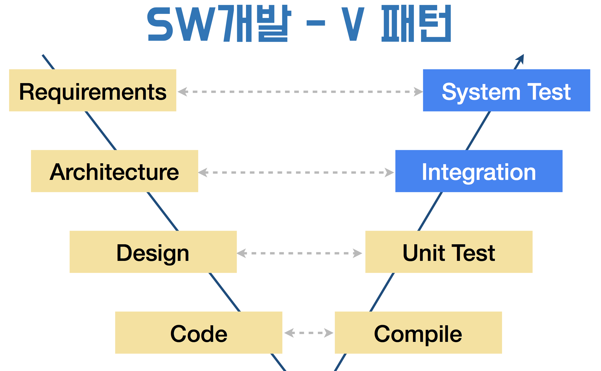

= 단위테스트(Unit Test)

=== 요구사항(Requirements)
* Requirement -> Feature -> Specification

===== 요구사항관리
* 요구사항을 통제하는 것이 아니라 계속 소통하고 관리해야함
* 실제 개발 업무 시간
** Planning : 10%
** 개발 작업 시간 : 65% 협업 과정포함)
** Integration + Debug : 25%

=== Testing
* 테스트 코드를 짤 때 객체 의존적이면 안됨

* SW 품질(Quality)
** 사용자는 개발자가 의도한대로 쓰지 않음

* SW공학
** Waterfall Process

* SW개발
** V패턴
** 짝을 직어서 테스트함

* SW 공학적 개발단계
** Code Complete에서 SW 개발과정 제시
** 전체에서 세부적으로 공학분류가 나눠지고 있음

==== 애자일 방법론
* 소프트웨어 개발 방법 하나로, 개발 대상을 다수의 작은 기능으로 분할하여 하나의 기능을 하나의 
반복 주기 내에 개발하는 개발 방법
* 기간은 1-4주정도, 하나의 기능을 추가 개발함
* 계획, 요구분석, 설계, 구현(코딩), 테스트 및 문서화 등 소프트웨어 프로젝트에 필요한 모든 과정이 하나의 반복 내에서 모두 실시함
* 반복이 끝날 때마다 기능이 추가된 새로운 소프트웨어(빌드, build)를 출시하는 것을 목표로 함
* 반복이 끝나면 프로젝트 팀은 프로젝트의 우선 순위를 재평가하여 다음 반복을 실시

==== Unit Testing

===== print, NSLog
* 일일히 프린트로 찍어보고 손으로 직접 테스트 하는 것을 `Smoke Test` 라고 함
* 안 좋은 방법임

===== _단위 테스트보다 큰 목적_
* *내 코드가 잘 돌아가나 확신할 수 있는 방법*
* 요구사항을 위해 설계했던 그대로 동작하는가?
* 예외적인 상황에서도 원하는 동작하도록?
* 내 의도를 문서화 할 때

===== Unit Testing TIP
* 객체가 의존적이지 않도록 값을 넘겨주는 형태로 작성하는 것이 좋음
* Right-BICEP
** Right
*** 결과가 올바른가? -> 요구사항은 변경함
*** 쉽게 빠르게 증명할 수 있음
*** 테스트 데이터 활용할 수 있음
** B(= Boundary)
*** 경계 값을 밝혀내는 것이 중요함
*** 엉터리 입력값, 잘못된 형식 데이터, 아예 없거나 빼먹은 값, 예상치를 벗어난 값, 중복값이 있으면 안되는데 중복된 값이 존재, 순서/정렬된 데이터에서 정렬이 맞지 않음
** I(= Inverse)
*** 루틴과 역루틴을 짜야함
** C(= Cross-check)
*** 다른 수단을 이용한 교차확인
*** 해당 알고리즘과 다른 알고리즘 비교, 데이터나 클래스를 분리해서 대조하는 방식도 고려해야 함
** E(= Error Condition)
*** 에러 조건 강제로 만듬
*** Mock 객체 이용
** P(= Performance)
*** 성능
*** 입력량이 많아지거나 문제가 복잡해짐, 빠른 회귀 테스트, 전문적인 도구를 이용할 수 있음
* 경계조건, CORRECT
** 경계 조건 버그 유발
** 형식일치(= Conformance) 
** 순서(= Ordering)
** 범위(= Range)
** 참조(= Reference)
** 존재성(= Existence) 
** 개체 수(= Cardinality) 
** 시간(= Time)
* A-TRIP
** 자동적(= Automatic)
*** 단위 테스트는 실행과 결과의 확인은 자동화 되어야 함
** 철저함(= Through)
*** 해당 기능의 문제가 될 경우의 수를 모두 테스트함
** 반복 가능(= Repeatable)
*** 순서 상관없이 반복 실행 가능하고 같은 결과가 나와야 함
** 독립적(= Independent)
*** 다른 테스트 / 외부 환경에 독립적 (의존성이 없어야 한다)
** 전문적(= Professional) 
*** 테스트 코드도 진짜 코드
*** _**테스트 가능한 코드 작성이 좋음**_