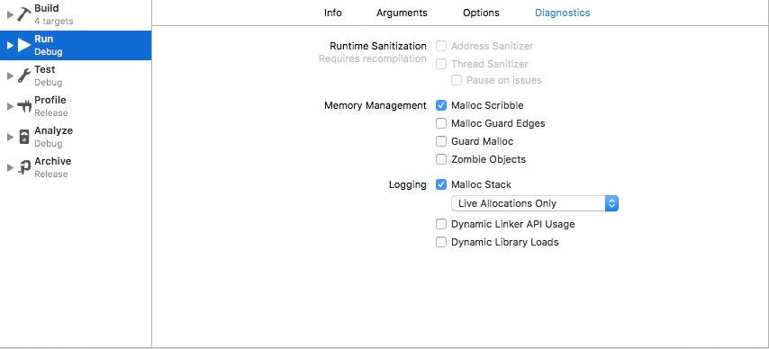
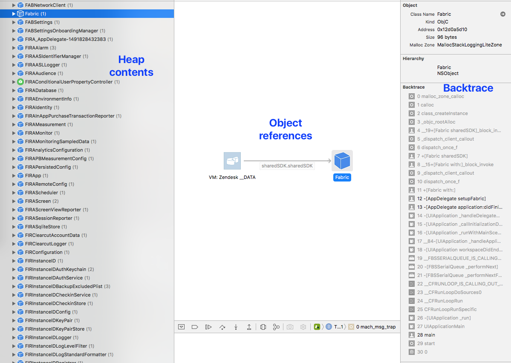
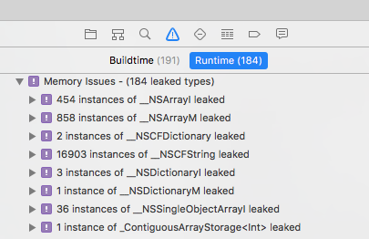

= XCode 메모리 릭 확인하는 방법

===== 질문
* XCode에서 클래스 메모리 릭 확인을 어떻게 하나요?

===== 정리

* `⌘ + ⇧ + ,` 단축키를 누르고 설정창이 뜸. 이미지와 같이 옵션을 설정함

* 메모리 디버깅 버튼을 누름

* 메모리 디버깅 그래프
** Heap contents => 힙 영역에 있는 정보를 보여줌
** Object references => 왼쪽 화면에 있는 정보 중 하나를 선택하면 참조하고 있는 인스턴스를 보여줌
** Backtrace => 가운데 화면에 있는 인스턴스 중 하나를 선택하면 메모리 정보와 Backtrace가 나타남

===== 추가 설명

* Heap contents 하단 화면에 있는 느낌표를 누르면 메모리 릭이 있는 인스턴스만 보여줌

* 런타임 이슈 네비게이터에서도 확인할 수 있음